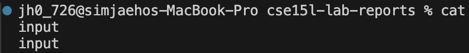
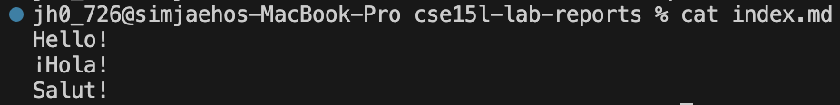

# `cd`
## With *No* Arguments 

**Absolute Path:** `/Users/jh0_726`

**Explanation of Output:** No argument after `cd` changes the working directory to home directory by default, which is a home directory `/Users/jh0_726`. A switch to home directory occurs as cd switches working directory to the given path, which is home directory, when there is no argument.

**Error:** Switching current working directory to home directory will not produce an error.

## With a Path to *Directory* as an Argument

**Absolute Path:** `/Users/jh0_726`

**Explanation of Output:** `cd` with a path to directory as an argument changes the current working directory to `/Users/jh0_726/cse15l-lab-reports` based on the given path, which is `cse15l-lab-reports`.

**Error:** Switching current working directory to `/Users/jh0_726/cse15l-lab-reports` through an argument will not cause an error as a path to directory is a valid argument. 

## With a Path to a *File* as an Argument

**Absolute Path:** `/Users/jh0_726/cse15l-lab-reports`

**Explanation of Output:** An argument with a path to file will fail to switch directory and will produce an error as files cannot function as directories.

**Error:** ‘no such file or directory: /Users/jh0_726/index.md’ error message will be printed as it is impossible to change directory to a specific file.

# `ls` 
## With *No* Arguments 

**Absolute Path:** `/Users/jh0_726`

**Explanation of Output:** `ls` with no arguments lists the files and folders of the current path, which is `/Users/jh0_726`. The output included files and folders found in Finder such as Applications, Desktop, and Documents.

**Error:** `ls` without any arguments successfully list files and folders of current path, meaning it has no error.

## With a Path to *Directory* as an Argument

**Absolute Path:** `/Users/jh0_726`

**Explanation of Output:** `ls` with a path to directory as an argument lists the files and folders of specific directory (`/Users/jh0_726/cse15l-lab-reports`). Files and folders found in Finder such as Applications, Desktop, and Documents are the examples that are listed as the output. 

**Error:** `ls` with a path to directory as an argument successfully list files and folders of specific path (`/Users/jh0_726`), indicating that there is no error.

## With a Path to a *File* as an Argument

**Absolute Path:** `/Users/jh0_726/cse15l-lab-reports`

**Explanation of Output:** `ls` with a path to a file as an argument displays file name as the directory leads to a file that has no file or folder inside. That being said, the lack of file or folders inside the file lead to printing the file name.

**Error:** `ls` with a path to a file as an argument successfully work without an error by providing a list of files and folders if the given path contains files or folders. If the directory leads to file, the file name was printed without an error.

# `cat` 
## With *No* Arguments 

**Absolute Path:** `/Users/jh0_726`

**Explanation of Output:** `cat` without any arguments doesn’t provide an output but instead waits for the input from the user. Just like the example above, the output would be the same as the user input.

**Error:** `cat` without any arguments will not produce an error as it prints the input of the user.

## With a Path to *Directory* as an Argument

**Absolute Path:** `/Users/jh0_726`

**Explanation of Output:** `cat` is used to print the contents of files given by the path. That being said, a path to directory as an argument will fail to produce an output as directories cannot be printed out.

**Error:** `cat` with a path to directory as an argument will produce an error as it fails to concatenate directory and print it out, indicating that the argument is a directory: `/Users/jh0_726/cse15l-lab-reports: Is a directory`

## With a Path to a *File* as an Argument

**Absolute Path:** `/Users/jh0_726/cse15l-lab-reports`

**Explanation of Output:** `cat` is used to print the contents of files given by the path. That being said, since the argument has provided a path to a file, it will print the contents of a specific file, which in my case would print hello in various languages.

**Error:** Since a file exists in the parent directory, it will print the contents of a specific file without an error.
