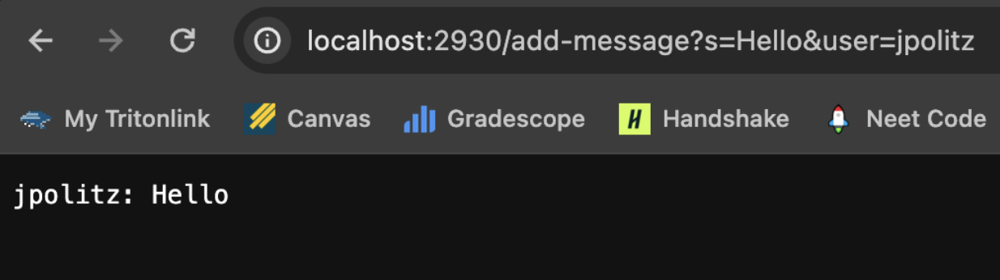
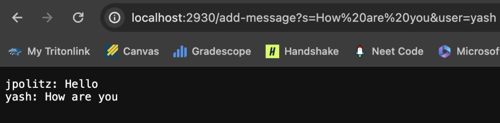
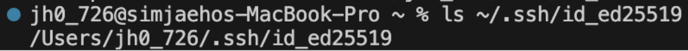
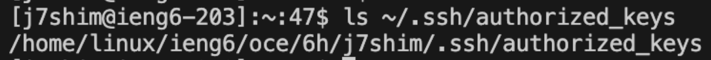
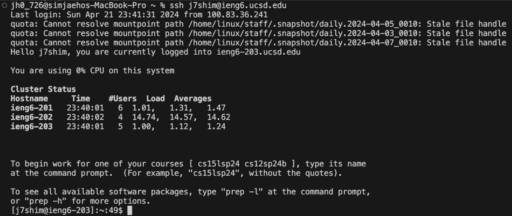

# Part 1
## `ChatServer.java` Code 
```
import java.io.IOException;
import java.net.URI;

class Handler implements URLHandler {
    String chatMessage = "";

    public String handleRequest(URI url) {
        if (url.getPath().equals("/")) {
            return "Welcome to chat server!";
        } 
        
        if (url.getPath().contains("/add-message")) {
            String message = ""; // initialize to empty string
            String user = ""; // initialize to empty string
            
            String[] parameters = url.getQuery().split("&");

            String messageParameter = parameters[0];
            message = messageParameter.split("=")[1];

            String userParameter = parameters[1];
            user = userParameter.split("=")[1];

            chatMessage += user + ": " + message + "\n";
            return chatMessage;
        }
        return "404 Not Found!";
    }
}

class ChatServer {
    public static void main(String[] args) throws IOException {
        if(args.length == 0){
            System.out.println("Missing port number! Try any number between 1024 to 49151");
            return;
        }

        int port = Integer.parseInt(args[0]);

        Server.start(port, new Handler());
    }
}
```
## `Server.java` Code
```
import java.io.IOException;
import java.io.OutputStream;
import java.net.InetSocketAddress;
import java.net.URI;

import com.sun.net.httpserver.HttpExchange;
import com.sun.net.httpserver.HttpHandler;
import com.sun.net.httpserver.HttpServer;

interface URLHandler {
    String handleRequest(URI url);
}

class ServerHttpHandler implements HttpHandler {
    URLHandler handler;
    ServerHttpHandler(URLHandler handler) {
      this.handler = handler;
    }
    public void handle(final HttpExchange exchange) throws IOException {
        // form return body after being handled by program
        try {
            String ret = handler.handleRequest(exchange.getRequestURI());
            // form the return string and write it on the browser
            exchange.sendResponseHeaders(200, ret.getBytes().length);
            OutputStream os = exchange.getResponseBody();
            os.write(ret.getBytes());
            os.close();
        } catch(Exception e) {
            String response = e.toString();
            exchange.sendResponseHeaders(500, response.getBytes().length);
            OutputStream os = exchange.getResponseBody();
            os.write(response.getBytes());
            os.close();
        }
    }
}

public class Server {
    public static void start(int port, URLHandler handler) throws IOException {
        HttpServer server = HttpServer.create(new InetSocketAddress(port), 0);

        //create request entrypoint
        server.createContext("/", new ServerHttpHandler(handler));

        //start the server
        server.start();
        System.out.println("Server Started! If on your local computer, visit http://localhost:" + port + " to visit.");
    }
}
```

---


*Screenshot 1*

### Method(s)
`handleRequest(URI url)` method was called when request was made. 
With the help from `getPath()` method from `URI` class as well as `.equals()` and `.contains()` methods, the `handleRequest (URI url)` method could check path of the link and process based on the query parameters. 

### Argument(s)
`url` argument with the type of `URI` was relevant, providing the web server link. The web server link "`localhost:2930/add-message?s=Hello&user=jpolitz`" was passed in to the `url` argument. 

### Field(s)
`chatMessage` field with the type of `String` was relevant, representing the accumulated output message. In this case, the `chatMessage` field hold a value of an empty string. 

### Change in Field Value(s)
`chatMessage` field, which used to hold empty string as a value, was updated by appending the message (*"jpolitz: Hello"*). Now, the `chatMessage` field stores a `String` value of "`jpolitz: Hello\n`". 

---


*Screenshot2*

### Method(s)
`handleRequest(URI url)` method was called when request was made. 
With the help from `getPath()` method from `URI` class as well as `.equals()` and `.contains()` methods, the `handleRequest (URI url)` method could check path of the link and process based on the query parameters. 

### Argument(s)
`url` argument with the type of `URI` was relevant, providing the web server link. The web server link "`localhost:2930/add-message?s=How%20are%20you&user=yash`" was passed in to the `url` argument. 

### Field(s)
`chatMessage` field with the type of `String` was relevant, representing the accumulated output message. In this case, the `chatMessage` field of previous message, which was "`jpolitz: Hello\n`".

### Change in Field Value(s)
`chatMessage` field, which used to hold previous message, was updated by appending the current message (*"yash: How are you"*). Now, the `chatMessage` field stores a `String` value of "`jpolitz: Hello\nyash: How are you\n`". 

--- 
# Part 2
### `ls` with the absolute path to the private key to log in to ieng6 server 

*Screenshot3*

### `ls` with the absolute path to the public key to log in to ieng6 server

*Screenshot4*

### Terminal interaction logging into ieng6 account without being asked for a password

*Screenshot5*

---
# Part 3

I used to not know how to launch a web server and what path functions in the url. 
Before lab 2, the url link, for me, was just a combination of random alphabets after the domain. 
However, after the lab, I learned how to create a web server from terminal using `curl` command and interact with the server with several path parameters. 
