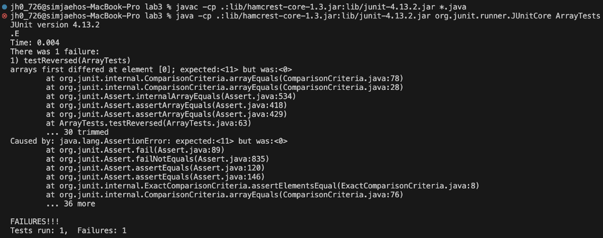
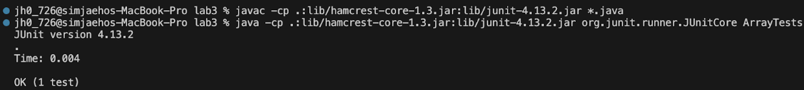

# Part 1: Bugs
## 1. A Failure-Inducing Input for the Buggy Program
Failure Inducing Input: 
```
@Test
 public void testReversed() {
   int[] input = {29, 10, 11};
   int[] expected = {11, 10, 29};
   ArrayExamples.reversed(input);
   assertArrayEquals(expected, input);
 }

```
Associated Code: 
```
public class ArrayExamples {

 static int[] reversed(int[] arr) {
   int[] newArray = new int[arr.length];
   for(int i = 0; i < arr.length; i += 1) {
     arr[i] = newArray[arr.length - i - 1];
   }
   return arr;
 }
}
```

## 2. An Input that Doesn't Induce a Failure
Non-Failure Inducing Input: 
```
@Test
 public void testReversed2() {
   int[] input = {1, 10, 100, 1000};
   int[] expected = {1000, 100, 10, 1};
   assertArrayEquals(expected, ArrayExamples.reversed(input));
 }
```
Associated Code: 
```
public class ArrayExamples {

 static int[] reversed(int[] arr) {
   int[] newArray = new int[arr.length];
   for(int i = 0; i < arr.length; i += 1) {
     newArray[i] = arr[arr.length - i - 1];
   }
   return newArray;
 }
}
```

## 3. The Output of Running the Two Tests Above
Failure Output: 

Success Output: 



## 4. The Bug (Code that Required to Fix It)
The bug was incorrect update of the element of the array and incorrect return array. 

Inccorect Code: 
```
public class ArrayExamples {

 static int[] reversed(int[] arr) {
   int[] newArray = new int[arr.length];
   for(int i = 0; i < arr.length; i += 1) {
     arr[i] = newArray[arr.length - i - 1];
   }
   return arr;
 }
}
```
- The code above updates the value to the input array (arr). 

Correct Code: 
```
public class ArrayExamples {

 static int[] reversed(int[] arr) {
   int[] newArray = new int[arr.length];
   for(int i = 0; i < arr.length; i += 1) {
     newArray[i] = arr[arr.length - i - 1];
   }
   return newArray;
 }
}
```
- The code above updates the value to the newly created array (newArray).

## 5. Briefly Describe Why the Fix Addresses the Issue
The code before fixing it updated the input array with the values of the new array. Considering that the new array was filled with initial integer value 0 for input array length amount, elements of the input array were updated to 0. However, the fixed code updates the elements of the new array with elements of the input array in reverse order and returns the updated new array. 

# Part 2: Researching Commands 
## `find` command 
### 4 Command Line Options
**1. `find ~/docsearch/technical/__(1)__ -name "*.txt"`**               *(1: specific path that contains .txt files)*

: finds and prints out all the txt files in specific path

1-1) `find ~/docsearch/technical/biomed -name "*.txt"` 
  * Output:
``` 
jh0_726@simjaehos-MacBook-Pro technical % find ~/docsearch/technical/biomed -name "*.txt"
/Users/jh0_726/docsearch/technical/biomed/1472-6807-2-2.txt
/Users/jh0_726/docsearch/technical/biomed/1471-2350-4-3.txt
/Users/jh0_726/docsearch/technical/biomed/1471-2156-2-3.txt
/Users/jh0_726/docsearch/technical/biomed/1471-2156-3-11.txt
/Users/jh0_726/docsearch/technical/biomed/1471-2121-3-10.txt
/Users/jh0_726/docsearch/technical/biomed/1471-2172-3-4.txt
/Users/jh0_726/docsearch/technical/biomed/gb-2002-4-1-r2.txt
/Users/jh0_726/docsearch/technical/biomed/gb-2003-4-6-r41.txt
/Users/jh0_726/docsearch/technical/biomed/1471-2466-1-1.txt
/Users/jh0_726/docsearch/technical/biomed/1471-2199-2-10.txt
/Users/jh0_726/docsearch/technical/biomed/1471-2202-2-9.txt
/Users/jh0_726/docsearch/technical/biomed/cc991.txt
/Users/jh0_726/docsearch/technical/biomed/1471-2369-3-9.txt
/Users/jh0_726/docsearch/technical/biomed/bcr620.txt
/Users/jh0_726/docsearch/technical/biomed/1476-069X-2-4.txt
/Users/jh0_726/docsearch/technical/biomed/1472-6750-3-11.txt
/Users/jh0_726/docsearch/technical/biomed/1471-2164-2-9.txt
/Users/jh0_726/docsearch/technical/biomed/1471-2091-2-10.txt
/Users/jh0_726/docsearch/technical/biomed/gb-2001-2-4-research0010.txt
/Users/jh0_726/docsearch/technical/biomed/gb-2003-4-4-r24.txt
/Users/jh0_726/docsearch/technical/biomed/1471-213X-2-1.txt
/Users/jh0_726/docsearch/technical/biomed/1472-6882-3-3.txt
/Users/jh0_726/docsearch/technical/biomed/1471-2407-2-3.txt
/Users/jh0_726/docsearch/technical/biomed/ar331.txt
/Users/jh0_726/docsearch/technical/biomed/ar319.txt
/Users/jh0_726/docsearch/technical/biomed/1471-2156-4-5.txt
/Users/jh0_726/docsearch/technical/biomed/1471-2431-2-1.txt
/Users/jh0_726/docsearch/technical/biomed/1476-4598-2-22.txt
/Users/jh0_726/docsearch/technical/biomed/1471-2180-2-22.txt
/Users/jh0_726/docsearch/technical/biomed/1471-2334-3-9.txt
/Users/jh0_726/docsearch/technical/biomed/1471-2091-2-11.txt
/Users/jh0_726/docsearch/technical/biomed/gb-2001-2-4-research0011.txt
/Users/jh0_726/docsearch/technical/biomed/1471-2202-4-12.txt
/Users/jh0_726/docsearch/technical/biomed/rr73.txt
/Users/jh0_726/docsearch/technical/biomed/1471-2164-2-8.txt
/Users/jh0_726/docsearch/technical/biomed/1471-2148-2-12.txt
/Users/jh0_726/docsearch/technical/biomed/bcr635.txt
/Users/jh0_726/docsearch/technical/biomed/1468-6708-3-10.txt
/Users/jh0_726/docsearch/technical/biomed/gb-2003-4-5-r34.txt
/Users/jh0_726/docsearch/technical/biomed/1471-2202-2-8.txt
/Users/jh0_726/docsearch/technical/biomed/1471-2121-3-11.txt
/Users/jh0_726/docsearch/technical/biomed/1471-2156-3-10.txt
/Users/jh0_726/docsearch/technical/biomed/1471-2458-3-20.txt
/Users/jh0_726/docsearch/technical/biomed/1471-2350-4-2.txt
/Users/jh0_726/docsearch/technical/biomed/1472-6807-2-3.txt
/Users/jh0_726/docsearch/technical/biomed/1472-6807-2-1.txt
/Users/jh0_726/docsearch/technical/biomed/1476-4598-1-8.txt
/Users/jh0_726/docsearch/technical/biomed/1477-7525-1-9.txt
/Users/jh0_726/docsearch/technical/biomed/ar79.txt
/Users/jh0_726/docsearch/technical/biomed/1476-0711-2-7.txt
/Users/jh0_726/docsearch/technical/biomed/1472-6947-3-8.txt
/Users/jh0_726/docsearch/technical/biomed/1471-2121-3-13.txt
/Users/jh0_726/docsearch/technical/biomed/gb-2002-4-1-r1.txt
/Users/jh0_726/docsearch/technical/biomed/1471-2407-3-18.txt
/Users/jh0_726/docsearch/technical/biomed/1471-2229-2-3.txt
/Users/jh0_726/docsearch/technical/biomed/1471-2334-1-9.txt
/Users/jh0_726/docsearch/technical/biomed/gb-2002-3-9-research0043.txt
/Users/jh0_726/docsearch/technical/biomed/1471-2415-3-5.txt
/Users/jh0_726/docsearch/technical/biomed/1471-2334-1-21.txt
/Users/jh0_726/docsearch/technical/biomed/gb-2001-2-7-research0025.txt
/Users/jh0_726/docsearch/technical/biomed/ar130.txt
/Users/jh0_726/docsearch/technical/biomed/1476-069X-2-7.txt
/Users/jh0_726/docsearch/technical/biomed/1472-6890-2-5.txt
/Users/jh0_726/docsearch/technical/biomed/ar118.txt
/Users/jh0_726/docsearch/technical/biomed/gb-2002-3-7-research0032.txt
/Users/jh0_726/docsearch/technical/biomed/1471-2253-2-5.txt
/Users/jh0_726/docsearch/technical/biomed/1471-2210-1-10.txt
/Users/jh0_726/docsearch/technical/biomed/1471-2091-2-13.txt
/Users/jh0_726/docsearch/technical/biomed/1471-2180-2-20.txt
/Users/jh0_726/docsearch/technical/biomed/1471-2202-3-19.txt
/Users/jh0_726/docsearch/technical/biomed/1471-2202-4-10.txt
/Users/jh0_726/docsearch/technical/biomed/1472-6963-2-10.txt
/Users/jh0_726/docsearch/technical/biomed/1476-4598-2-20.txt
/Users/jh0_726/docsearch/technical/biomed/1471-2156-4-6.txt
/Users/jh0_726/docsearch/technical/biomed/1471-2458-3-5.txt
/Users/jh0_726/docsearch/technical/biomed/1472-6769-1-4.txt
/Users/jh0_726/docsearch/technical/biomed/gb-2003-4-4-r26.txt
/Users/jh0_726/docsearch/technical/biomed/1472-6882-3-1.txt
/Users/jh0_726/docsearch/technical/biomed/cc4.txt
/Users/jh0_726/docsearch/technical/biomed/1471-2180-2-35.txt
/Users/jh0_726/docsearch/technical/biomed/1471-2202-4-11.txt
/Users/jh0_726/docsearch/technical/biomed/gb-2001-2-4-research0012.txt
/Users/jh0_726/docsearch/technical/biomed/1471-2091-2-12.txt
/Users/jh0_726/docsearch/technical/biomed/1471-2253-2-4.txt
/Users/jh0_726/docsearch/technical/biomed/gb-2001-2-7-research0024.txt
/Users/jh0_726/docsearch/technical/biomed/1471-2415-3-4.txt
/Users/jh0_726/docsearch/technical/biomed/1471-2199-2-12.txt
/Users/jh0_726/docsearch/technical/biomed/1471-2121-3-12.txt
/Users/jh0_726/docsearch/technical/biomed/1471-2148-1-8.txt
/Users/jh0_726/docsearch/technical/biomed/gb-2001-2-3-research0008.txt
/Users/jh0_726/docsearch/technical/biomed/1471-2156-2-1.txt
/Users/jh0_726/docsearch/technical/biomed/1471-2466-3-1.txt
/Users/jh0_726/docsearch/technical/biomed/bcr568.txt
/Users/jh0_726/docsearch/technical/biomed/gb-2003-4-7-r46.txt
/Users/jh0_726/docsearch/technical/biomed/1475-2875-2-14.txt
/Users/jh0_726/docsearch/technical/biomed/1471-2288-2-4.txt
/Users/jh0_726/docsearch/technical/biomed/1472-6785-1-3.txt
/Users/jh0_726/docsearch/technical/biomed/ar93.txt
/Users/jh0_726/docsearch/technical/biomed/1472-6831-2-2.txt
/Users/jh0_726/docsearch/technical/biomed/bcr583.txt
/Users/jh0_726/docsearch/technical/biomed/cc367.txt
/Users/jh0_726/docsearch/technical/biomed/1477-7827-1-17.txt
/Users/jh0_726/docsearch/technical/biomed/1477-7827-1-13.txt
/Users/jh0_726/docsearch/technical/biomed/1472-6807-2-4.txt
/Users/jh0_726/docsearch/technical/biomed/1471-2156-3-17.txt
/Users/jh0_726/docsearch/technical/biomed/1475-2875-2-10.txt
/Users/jh0_726/docsearch/technical/biomed/gb-2003-4-7-r42.txt
/Users/jh0_726/docsearch/technical/biomed/1471-2156-2-5.txt
/Users/jh0_726/docsearch/technical/biomed/ar68.txt
/Users/jh0_726/docsearch/technical/biomed/1471-2172-3-2.txt
/Users/jh0_726/docsearch/technical/biomed/1471-2121-3-16.txt
/Users/jh0_726/docsearch/technical/biomed/1472-6750-1-12.txt
/Users/jh0_726/docsearch/technical/biomed/1472-6904-2-7.txt
/Users/jh0_726/docsearch/technical/biomed/1472-6882-1-7.txt
/Users/jh0_726/docsearch/technical/biomed/1471-2334-1-24.txt
/Users/jh0_726/docsearch/technical/biomed/1471-2377-2-4.txt
/Users/jh0_726/docsearch/technical/biomed/gb-2002-3-9-research0046.txt
/Users/jh0_726/docsearch/technical/biomed/rr74.txt
/Users/jh0_726/docsearch/technical/biomed/gb-2002-3-7-research0037.txt
/Users/jh0_726/docsearch/technical/biomed/gb-2001-2-8-research0027.txt
/Users/jh0_726/docsearch/technical/biomed/1476-069X-2-2.txt
/Users/jh0_726/docsearch/technical/biomed/1471-2148-2-15.txt
/Users/jh0_726/docsearch/technical/biomed/1472-6874-2-1.txt
/Users/jh0_726/docsearch/technical/biomed/1471-2210-1-8.txt
/Users/jh0_726/docsearch/technical/biomed/1471-2091-3-8.txt
/Users/jh0_726/docsearch/technical/biomed/1472-6793-2-8.txt
/Users/jh0_726/docsearch/technical/biomed/1471-213X-2-7.txt
/Users/jh0_726/docsearch/technical/biomed/1471-2202-3-20.txt
/Users/jh0_726/docsearch/technical/biomed/1471-2091-2-16.txt
/Users/jh0_726/docsearch/technical/biomed/1476-4598-2-25.txt
/Users/jh0_726/docsearch/technical/biomed/1471-230X-2-21.txt
/Users/jh0_726/docsearch/technical/biomed/1476-4598-2-24.txt
/Users/jh0_726/docsearch/technical/biomed/1471-2350-2-2.txt
/Users/jh0_726/docsearch/technical/biomed/gb-2001-2-11-research0046.txt
/Users/jh0_726/docsearch/technical/biomed/1472-6769-1-1.txt
/Users/jh0_726/docsearch/technical/biomed/ar120.txt
/Users/jh0_726/docsearch/technical/biomed/1471-2148-2-14.txt
/Users/jh0_726/docsearch/technical/biomed/1471-2407-1-19.txt
/Users/jh0_726/docsearch/technical/biomed/gb-2001-2-8-research0032.txt
/Users/jh0_726/docsearch/technical/biomed/gb-2002-3-7-research0036.txt
/Users/jh0_726/docsearch/technical/biomed/1471-2415-3-1.txt
/Users/jh0_726/docsearch/technical/biomed/gb-2003-4-5-r32.txt
/Users/jh0_726/docsearch/technical/biomed/1472-6750-1-13.txt
/Users/jh0_726/docsearch/technical/biomed/1472-6920-1-3.txt
/Users/jh0_726/docsearch/technical/biomed/1471-2474-2-1.txt
/Users/jh0_726/docsearch/technical/biomed/1476-0711-2-3.txt
/Users/jh0_726/docsearch/technical/biomed/rr171.txt
/Users/jh0_726/docsearch/technical/biomed/1471-2156-3-16.txt
/Users/jh0_726/docsearch/technical/biomed/gb-2003-4-7-r43.txt
/Users/jh0_726/docsearch/technical/biomed/1472-6807-2-5.txt
/Users/jh0_726/docsearch/technical/biomed/1471-2350-4-4.txt
/Users/jh0_726/docsearch/technical/biomed/1471-2172-1-1.txt
/Users/jh0_726/docsearch/technical/biomed/ar297.txt
/Users/jh0_726/docsearch/technical/biomed/1471-2350-4-6.txt
/Users/jh0_726/docsearch/technical/biomed/rr167.txt
/Users/jh0_726/docsearch/technical/biomed/1471-2474-2-3.txt
/Users/jh0_726/docsearch/technical/biomed/1471-2121-3-15.txt
/Users/jh0_726/docsearch/technical/biomed/1471-2172-3-1.txt
/Users/jh0_726/docsearch/technical/biomed/1472-6904-2-4.txt
/Users/jh0_726/docsearch/technical/biomed/1472-6750-1-11.txt
/Users/jh0_726/docsearch/technical/biomed/gb-2003-4-5-r30.txt
/Users/jh0_726/docsearch/technical/biomed/gb-2002-3-9-research0051.txt
/Users/jh0_726/docsearch/technical/biomed/1471-2415-3-3.txt
/Users/jh0_726/docsearch/technical/biomed/gb-2002-3-9-research0045.txt
/Users/jh0_726/docsearch/technical/biomed/gb-2001-2-8-research0030.txt
/Users/jh0_726/docsearch/technical/biomed/bcr631.txt
/Users/jh0_726/docsearch/technical/biomed/1472-6769-1-3.txt
/Users/jh0_726/docsearch/technical/biomed/cc3.txt
/Users/jh0_726/docsearch/technical/biomed/1471-2180-2-32.txt
/Users/jh0_726/docsearch/technical/biomed/1471-2202-4-16.txt
/Users/jh0_726/docsearch/technical/biomed/1471-2180-2-26.txt
/Users/jh0_726/docsearch/technical/biomed/1471-2431-2-4.txt
/Users/jh0_726/docsearch/technical/biomed/1471-2458-3-2.txt
/Users/jh0_726/docsearch/technical/biomed/1475-9276-1-3.txt
/Users/jh0_726/docsearch/technical/biomed/ar321.txt
/Users/jh0_726/docsearch/technical/biomed/1471-230X-2-23.txt
/Users/jh0_726/docsearch/technical/biomed/ar309.txt
/Users/jh0_726/docsearch/technical/biomed/gb-2001-2-4-research0014.txt
/Users/jh0_726/docsearch/technical/biomed/1477-7819-1-10.txt
/Users/jh0_726/docsearch/technical/biomed/gb-2001-2-11-research0045.txt
/Users/jh0_726/docsearch/technical/biomed/1471-2202-4-17.txt
/Users/jh0_726/docsearch/technical/biomed/1472-6769-1-2.txt
/Users/jh0_726/docsearch/technical/biomed/bcr618.txt
/Users/jh0_726/docsearch/technical/biomed/gb-2002-3-7-research0035.txt
/Users/jh0_726/docsearch/technical/biomed/gb-2001-2-8-research0031.txt
/Users/jh0_726/docsearch/technical/biomed/1471-2148-2-17.txt
/Users/jh0_726/docsearch/technical/biomed/1471-2229-2-4.txt
/Users/jh0_726/docsearch/technical/biomed/1471-2350-3-12.txt
/Users/jh0_726/docsearch/technical/biomed/gb-2002-3-9-research0044.txt
/Users/jh0_726/docsearch/technical/biomed/1471-2377-2-6.txt
/Users/jh0_726/docsearch/technical/biomed/1471-2474-4-4.txt
/Users/jh0_726/docsearch/technical/biomed/1472-6904-2-5.txt
/Users/jh0_726/docsearch/technical/biomed/1472-6823-3-1.txt
/Users/jh0_726/docsearch/technical/biomed/1471-2474-2-2.txt
/Users/jh0_726/docsearch/technical/biomed/rr166.txt
/Users/jh0_726/docsearch/technical/biomed/rr172.txt
/Users/jh0_726/docsearch/technical/biomed/1471-2156-2-7.txt
/Users/jh0_726/docsearch/technical/biomed/1472-6785-1-5.txt
/Users/jh0_726/docsearch/technical/biomed/bcr284.txt
/Users/jh0_726/docsearch/technical/biomed/gb-2002-3-2-research0008.txt
/Users/jh0_726/docsearch/technical/biomed/gb-2002-3-11-research0059.txt
/Users/jh0_726/docsearch/technical/biomed/cc2190.txt
/Users/jh0_726/docsearch/technical/biomed/gb-2002-3-11-research0065.txt
/Users/jh0_726/docsearch/technical/biomed/1471-213X-3-2.txt
/Users/jh0_726/docsearch/technical/biomed/1471-2148-3-18.txt
/Users/jh0_726/docsearch/technical/biomed/1471-2229-3-3.txt
/Users/jh0_726/docsearch/technical/biomed/1471-2172-4-1.txt
/Users/jh0_726/docsearch/technical/biomed/ar795.txt
/Users/jh0_726/docsearch/technical/biomed/1471-2164-3-15.txt
/Users/jh0_726/docsearch/technical/biomed/cc1843.txt
/Users/jh0_726/docsearch/technical/biomed/1471-2164-3-29.txt
/Users/jh0_726/docsearch/technical/biomed/1471-2458-2-16.txt
/Users/jh0_726/docsearch/technical/biomed/1475-925X-2-10.txt
/Users/jh0_726/docsearch/technical/biomed/1472-6807-3-1.txt
/Users/jh0_726/docsearch/technical/biomed/gb-2003-4-9-r58.txt
/Users/jh0_726/docsearch/technical/biomed/1471-2105-4-27.txt
/Users/jh0_726/docsearch/technical/biomed/1471-2105-3-12.txt
/Users/jh0_726/docsearch/technical/biomed/gb-2003-4-2-r16.txt
/Users/jh0_726/docsearch/technical/biomed/ar408.txt
/Users/jh0_726/docsearch/technical/biomed/ar409.txt
/Users/jh0_726/docsearch/technical/biomed/1471-2407-2-11.txt
/Users/jh0_726/docsearch/technical/biomed/gb-2001-2-10-research0041.txt
/Users/jh0_726/docsearch/technical/biomed/1471-2288-3-4.txt
/Users/jh0_726/docsearch/technical/biomed/1471-2105-4-26.txt
/Users/jh0_726/docsearch/technical/biomed/1471-230X-1-5.txt
/Users/jh0_726/docsearch/technical/biomed/gb-2002-3-8-research0040.txt
/Users/jh0_726/docsearch/technical/biomed/1475-925X-2-11.txt
/Users/jh0_726/docsearch/technical/biomed/gb-2001-2-9-research0035.txt
/Users/jh0_726/docsearch/technical/biomed/1471-2172-3-12.txt
/Users/jh0_726/docsearch/technical/biomed/gb-2003-4-6-r37.txt
/Users/jh0_726/docsearch/technical/biomed/1472-6750-1-8.txt
/Users/jh0_726/docsearch/technical/biomed/1471-244X-2-9.txt
/Users/jh0_726/docsearch/technical/biomed/gb-2002-3-12-research0085.txt
/Users/jh0_726/docsearch/technical/biomed/1471-213X-1-1.txt
/Users/jh0_726/docsearch/technical/biomed/1471-2164-4-21.txt
/Users/jh0_726/docsearch/technical/biomed/cc1856.txt
/Users/jh0_726/docsearch/technical/biomed/1471-2180-3-15.txt
/Users/jh0_726/docsearch/technical/biomed/1471-2164-3-28.txt
/Users/jh0_726/docsearch/technical/biomed/cc105.txt
/Users/jh0_726/docsearch/technical/biomed/1471-2202-2-10.txt
/Users/jh0_726/docsearch/technical/biomed/1471-2180-1-8.txt
/Users/jh0_726/docsearch/technical/biomed/1471-2431-3-3.txt
/Users/jh0_726/docsearch/technical/biomed/1471-2369-3-10.txt
/Users/jh0_726/docsearch/technical/biomed/1471-213X-3-3.txt
/Users/jh0_726/docsearch/technical/biomed/cc1498.txt
/Users/jh0_726/docsearch/technical/biomed/1471-2377-1-2.txt
/Users/jh0_726/docsearch/technical/biomed/1471-2350-3-7.txt
/Users/jh0_726/docsearch/technical/biomed/gb-2002-3-2-research0009.txt
/Users/jh0_726/docsearch/technical/biomed/bcr285.txt
/Users/jh0_726/docsearch/technical/biomed/gb-2002-3-6-software0001.txt
/Users/jh0_726/docsearch/technical/biomed/1475-2867-3-12.txt
/Users/jh0_726/docsearch/technical/biomed/1471-2229-1-2.txt
/Users/jh0_726/docsearch/technical/biomed/1471-2407-3-3.txt
/Users/jh0_726/docsearch/technical/biomed/1472-6890-1-4.txt
/Users/jh0_726/docsearch/technical/biomed/1471-2172-4-2.txt
/Users/jh0_726/docsearch/technical/biomed/1471-2164-3-16.txt
/Users/jh0_726/docsearch/technical/biomed/1471-2091-3-18.txt
/Users/jh0_726/docsearch/technical/biomed/1471-2202-2-12.txt
/Users/jh0_726/docsearch/technical/biomed/1471-2164-4-23.txt
/Users/jh0_726/docsearch/technical/biomed/1471-213X-1-3.txt
/Users/jh0_726/docsearch/technical/biomed/gb-2002-3-12-research0087.txt
/Users/jh0_726/docsearch/technical/biomed/1471-2091-3-30.txt
/Users/jh0_726/docsearch/technical/biomed/gb-2002-3-12-research0078.txt
/Users/jh0_726/docsearch/technical/biomed/1471-2164-3-9.txt
/Users/jh0_726/docsearch/technical/biomed/1471-2172-3-10.txt
/Users/jh0_726/docsearch/technical/biomed/1471-2172-2-4.txt
/Users/jh0_726/docsearch/technical/biomed/1471-2180-1-12.txt
/Users/jh0_726/docsearch/technical/biomed/gb-2001-2-6-research0018.txt
/Users/jh0_726/docsearch/technical/biomed/gb-2001-2-9-research0037.txt
/Users/jh0_726/docsearch/technical/biomed/1471-2105-2-9.txt
/Users/jh0_726/docsearch/technical/biomed/1472-6904-3-1.txt
/Users/jh0_726/docsearch/technical/biomed/1472-6793-2-16.txt
/Users/jh0_726/docsearch/technical/biomed/1472-6807-3-2.txt
/Users/jh0_726/docsearch/technical/biomed/1476-072X-2-4.txt
/Users/jh0_726/docsearch/technical/biomed/1471-2121-2-18.txt
/Users/jh0_726/docsearch/technical/biomed/1471-2148-2-8.txt
/Users/jh0_726/docsearch/technical/biomed/1471-2105-4-24.txt
/Users/jh0_726/docsearch/technical/biomed/1471-2156-3-3.txt
/Users/jh0_726/docsearch/technical/biomed/1471-2466-2-3.txt
/Users/jh0_726/docsearch/technical/biomed/1471-230X-3-5.txt
/Users/jh0_726/docsearch/technical/biomed/1471-2407-2-12.txt
/Users/jh0_726/docsearch/technical/biomed/gb-2003-4-2-r14.txt
/Users/jh0_726/docsearch/technical/biomed/1472-6904-1-2.txt
/Users/jh0_726/docsearch/technical/biomed/cc1538.txt
/Users/jh0_726/docsearch/technical/biomed/1471-2105-4-25.txt
/Users/jh0_726/docsearch/technical/biomed/1471-2105-3-38.txt
/Users/jh0_726/docsearch/technical/biomed/ar422.txt
/Users/jh0_726/docsearch/technical/biomed/gb-2001-2-10-research0042.txt
/Users/jh0_726/docsearch/technical/biomed/1471-2105-4-31.txt
/Users/jh0_726/docsearch/technical/biomed/1472-6831-3-1.txt
/Users/jh0_726/docsearch/technical/biomed/ar387.txt
/Users/jh0_726/docsearch/technical/biomed/1471-230X-1-6.txt
/Users/jh0_726/docsearch/technical/biomed/1472-6793-2-17.txt
/Users/jh0_726/docsearch/technical/biomed/1471-2156-2-18.txt
/Users/jh0_726/docsearch/technical/biomed/1471-2105-2-8.txt
/Users/jh0_726/docsearch/technical/biomed/1475-925X-2-12.txt
/Users/jh0_726/docsearch/technical/biomed/1478-7954-1-3.txt
/Users/jh0_726/docsearch/technical/biomed/1472-6807-1-1.txt
/Users/jh0_726/docsearch/technical/biomed/cc1882.txt
/Users/jh0_726/docsearch/technical/biomed/1471-2164-3-8.txt
/Users/jh0_726/docsearch/technical/biomed/1471-2180-3-9.txt
/Users/jh0_726/docsearch/technical/biomed/gb-2002-3-12-research0079.txt
/Users/jh0_726/docsearch/technical/biomed/1471-2091-3-31.txt
/Users/jh0_726/docsearch/technical/biomed/gb-2002-3-12-research0086.txt
/Users/jh0_726/docsearch/technical/biomed/1471-2164-4-22.txt
/Users/jh0_726/docsearch/technical/biomed/1471-213X-1-2.txt
/Users/jh0_726/docsearch/technical/biomed/1471-2202-3-8.txt
/Users/jh0_726/docsearch/technical/biomed/1471-2458-2-6.txt
/Users/jh0_726/docsearch/technical/biomed/1477-7827-1-48.txt
/Users/jh0_726/docsearch/technical/biomed/1471-2229-1-3.txt
/Users/jh0_726/docsearch/technical/biomed/1471-213X-3-4.txt
/Users/jh0_726/docsearch/technical/biomed/cc300.txt
/Users/jh0_726/docsearch/technical/biomed/1476-069X-1-3.txt
/Users/jh0_726/docsearch/technical/biomed/1471-2253-1-1.txt
/Users/jh0_726/docsearch/technical/biomed/1471-2431-3-4.txt
/Users/jh0_726/docsearch/technical/biomed/1471-2210-2-9.txt
/Users/jh0_726/docsearch/technical/biomed/gb-2002-3-12-research0082.txt
/Users/jh0_726/docsearch/technical/biomed/1471-213X-1-6.txt
/Users/jh0_726/docsearch/technical/biomed/1471-2164-4-26.txt
/Users/jh0_726/docsearch/technical/biomed/1471-2164-3-13.txt
/Users/jh0_726/docsearch/technical/biomed/1471-2202-2-17.txt
/Users/jh0_726/docsearch/technical/biomed/1472-6874-3-2.txt
/Users/jh0_726/docsearch/technical/biomed/ar778.txt
/Users/jh0_726/docsearch/technical/biomed/ar750.txt
/Users/jh0_726/docsearch/technical/biomed/1471-2474-3-3.txt
/Users/jh0_726/docsearch/technical/biomed/1472-6785-2-6.txt
/Users/jh0_726/docsearch/technical/biomed/1471-2490-3-2.txt
/Users/jh0_726/docsearch/technical/biomed/1477-7827-1-9.txt
/Users/jh0_726/docsearch/technical/biomed/gb-2001-2-6-research0021.txt
/Users/jh0_726/docsearch/technical/biomed/ar624.txt
/Users/jh0_726/docsearch/technical/biomed/1471-2121-2-21.txt
/Users/jh0_726/docsearch/technical/biomed/1472-6920-2-3.txt
/Users/jh0_726/docsearch/technical/biomed/ar383.txt
/Users/jh0_726/docsearch/technical/biomed/1471-2105-3-14.txt
/Users/jh0_726/docsearch/technical/biomed/1471-2407-2-16.txt
/Users/jh0_726/docsearch/technical/biomed/1471-2105-3-28.txt
/Users/jh0_726/docsearch/technical/biomed/gb-2003-4-2-r11.txt
/Users/jh0_726/docsearch/technical/biomed/cc1529.txt
/Users/jh0_726/docsearch/technical/biomed/1471-2407-2-17.txt
/Users/jh0_726/docsearch/technical/biomed/1472-6815-2-3.txt
/Users/jh0_726/docsearch/technical/biomed/ar619.txt
/Users/jh0_726/docsearch/technical/biomed/1471-2458-2-11.txt
/Users/jh0_726/docsearch/technical/biomed/gb-2001-2-6-research0020.txt
/Users/jh0_726/docsearch/technical/biomed/1472-6785-2-7.txt
/Users/jh0_726/docsearch/technical/biomed/1471-2180-1-16.txt
/Users/jh0_726/docsearch/technical/biomed/ar745.txt
/Users/jh0_726/docsearch/technical/biomed/1472-6890-3-2.txt
/Users/jh0_726/docsearch/technical/biomed/cc103.txt
/Users/jh0_726/docsearch/technical/biomed/1471-2202-2-16.txt
/Users/jh0_726/docsearch/technical/biomed/ar792.txt
/Users/jh0_726/docsearch/technical/biomed/gb-2002-3-12-research0083.txt
/Users/jh0_726/docsearch/technical/biomed/1471-2180-3-13.txt
/Users/jh0_726/docsearch/technical/biomed/1471-2210-2-8.txt
/Users/jh0_726/docsearch/technical/biomed/1472-6793-1-8.txt
/Users/jh0_726/docsearch/technical/biomed/1471-2458-2-3.txt
/Users/jh0_726/docsearch/technical/biomed/1472-6750-2-21.txt
/Users/jh0_726/docsearch/technical/biomed/1471-2431-3-5.txt
/Users/jh0_726/docsearch/technical/biomed/1472-6882-2-10.txt
/Users/jh0_726/docsearch/technical/biomed/1471-2350-3-1.txt
/Users/jh0_726/docsearch/technical/biomed/gb-2002-3-11-research0062.txt
/Users/jh0_726/docsearch/technical/biomed/1472-6882-2-5.txt
/Users/jh0_726/docsearch/technical/biomed/gb-2002-3-11-research0060.txt
/Users/jh0_726/docsearch/technical/biomed/1471-213X-3-7.txt
/Users/jh0_726/docsearch/technical/biomed/cc303.txt
/Users/jh0_726/docsearch/technical/biomed/cc1477.txt
/Users/jh0_726/docsearch/technical/biomed/1471-2407-3-5.txt
/Users/jh0_726/docsearch/technical/biomed/1471-2377-3-4.txt
/Users/jh0_726/docsearch/technical/biomed/1471-2180-3-11.txt
/Users/jh0_726/docsearch/technical/biomed/gb-2002-3-12-research0081.txt
/Users/jh0_726/docsearch/technical/biomed/cc1852.txt
/Users/jh0_726/docsearch/technical/biomed/1471-2164-4-25.txt
/Users/jh0_726/docsearch/technical/biomed/1471-2091-3-22.txt
/Users/jh0_726/docsearch/technical/biomed/1471-2202-2-14.txt
/Users/jh0_726/docsearch/technical/biomed/1471-2164-3-10.txt
/Users/jh0_726/docsearch/technical/biomed/1471-2164-4-19.txt
/Users/jh0_726/docsearch/technical/biomed/cc713.txt
/Users/jh0_726/docsearch/technical/biomed/1471-2172-3-16.txt
/Users/jh0_726/docsearch/technical/biomed/1471-2180-1-28.txt
/Users/jh0_726/docsearch/technical/biomed/1471-230X-1-10.txt
/Users/jh0_726/docsearch/technical/biomed/1471-2121-2-22.txt
/Users/jh0_726/docsearch/technical/biomed/1471-2334-2-29.txt
/Users/jh0_726/docsearch/technical/biomed/1471-2121-3-8.txt
/Users/jh0_726/docsearch/technical/biomed/1472-6963-1-8.txt
/Users/jh0_726/docsearch/technical/biomed/1471-2296-3-19.txt
/Users/jh0_726/docsearch/technical/biomed/1471-2407-2-15.txt
/Users/jh0_726/docsearch/technical/biomed/1471-2105-3-17.txt
/Users/jh0_726/docsearch/technical/biomed/1471-230X-3-3.txt
/Users/jh0_726/docsearch/technical/biomed/ar430.txt
/Users/jh0_726/docsearch/technical/biomed/1471-2156-3-4.txt
/Users/jh0_726/docsearch/technical/biomed/1471-2466-2-4.txt
/Users/jh0_726/docsearch/technical/biomed/1471-2296-3-18.txt
/Users/jh0_726/docsearch/technical/biomed/1471-2105-3-16.txt
/Users/jh0_726/docsearch/technical/biomed/1472-6920-2-1.txt
/Users/jh0_726/docsearch/technical/biomed/1476-072X-2-3.txt
/Users/jh0_726/docsearch/technical/biomed/gb-2003-4-9-r60.txt
/Users/jh0_726/docsearch/technical/biomed/ar140.txt
/Users/jh0_726/docsearch/technical/biomed/gb-2003-4-3-r17.txt
/Users/jh0_726/docsearch/technical/biomed/1472-6793-2-11.txt
/Users/jh0_726/docsearch/technical/biomed/1472-6823-2-2.txt
/Users/jh0_726/docsearch/technical/biomed/1471-2180-1-29.txt
/Users/jh0_726/docsearch/technical/biomed/1471-2172-2-3.txt
/Users/jh0_726/docsearch/technical/biomed/1471-2407-1-6.txt
/Users/jh0_726/docsearch/technical/biomed/1471-2091-2-9.txt
/Users/jh0_726/docsearch/technical/biomed/1471-2202-2-15.txt
/Users/jh0_726/docsearch/technical/biomed/1471-2091-3-23.txt
/Users/jh0_726/docsearch/technical/biomed/1471-2164-4-24.txt
/Users/jh0_726/docsearch/technical/biomed/1471-213X-1-4.txt
/Users/jh0_726/docsearch/technical/biomed/gb-2002-3-12-research0080.txt
/Users/jh0_726/docsearch/technical/biomed/1471-2180-3-10.txt
/Users/jh0_726/docsearch/technical/biomed/cc1476.txt
/Users/jh0_726/docsearch/technical/biomed/1471-2407-3-4.txt
/Users/jh0_726/docsearch/technical/biomed/1471-2431-3-6.txt
/Users/jh0_726/docsearch/technical/biomed/bcr294.txt
/Users/jh0_726/docsearch/technical/biomed/gb-2002-3-11-research0061.txt
/Users/jh0_726/docsearch/technical/biomed/1477-7827-1-43.txt
/Users/jh0_726/docsearch/technical/biomed/1475-2832-1-1.txt
/Users/jh0_726/docsearch/technical/biomed/1471-2199-3-12.txt
/Users/jh0_726/docsearch/technical/biomed/1471-2202-1-1.txt
/Users/jh0_726/docsearch/technical/biomed/1472-6750-2-13.txt
/Users/jh0_726/docsearch/technical/biomed/cc2172.txt
/Users/jh0_726/docsearch/technical/biomed/1472-6793-1-6.txt
/Users/jh0_726/docsearch/technical/biomed/1471-2210-2-6.txt
/Users/jh0_726/docsearch/technical/biomed/1471-213X-1-9.txt
/Users/jh0_726/docsearch/technical/biomed/1471-2164-3-34.txt
/Users/jh0_726/docsearch/technical/biomed/1471-2164-4-15.txt
/Users/jh0_726/docsearch/technical/biomed/1471-2202-3-3.txt
/Users/jh0_726/docsearch/technical/biomed/1471-2202-2-18.txt
/Users/jh0_726/docsearch/technical/biomed/cc2358.txt
/Users/jh0_726/docsearch/technical/biomed/1472-6793-3-4.txt
/Users/jh0_726/docsearch/technical/biomed/gb-2002-3-12-research0072.txt
/Users/jh0_726/docsearch/technical/biomed/1472-6963-3-11.txt
/Users/jh0_726/docsearch/technical/biomed/1472-6963-3-6.txt
/Users/jh0_726/docsearch/technical/biomed/1476-4598-2-3.txt
/Users/jh0_726/docsearch/technical/biomed/1477-7827-1-6.txt
/Users/jh0_726/docsearch/technical/biomed/1475-4924-1-10.txt
/Users/jh0_726/docsearch/technical/biomed/1472-6874-2-13.txt
/Users/jh0_726/docsearch/technical/biomed/1471-2369-4-5.txt
/Users/jh0_726/docsearch/technical/biomed/1471-2121-3-4.txt
/Users/jh0_726/docsearch/technical/biomed/1471-2121-2-12.txt
/Users/jh0_726/docsearch/technical/biomed/1471-2148-2-2.txt
/Users/jh0_726/docsearch/technical/biomed/1475-925X-2-6.txt
/Users/jh0_726/docsearch/technical/biomed/1471-2148-1-14.txt
/Users/jh0_726/docsearch/technical/biomed/1471-2407-2-19.txt
/Users/jh0_726/docsearch/technical/biomed/1471-2210-2-14.txt
/Users/jh0_726/docsearch/technical/biomed/1475-2867-3-4.txt
/Users/jh0_726/docsearch/technical/biomed/ar429.txt
/Users/jh0_726/docsearch/technical/biomed/1471-2407-2-31.txt
/Users/jh0_726/docsearch/technical/biomed/1471-2105-3-26.txt
/Users/jh0_726/docsearch/technical/biomed/1477-7525-1-12.txt
/Users/jh0_726/docsearch/technical/biomed/1471-2407-2-18.txt
/Users/jh0_726/docsearch/technical/biomed/1471-2105-4-13.txt
/Users/jh0_726/docsearch/technical/biomed/gb-2003-4-1-r5.txt
/Users/jh0_726/docsearch/technical/biomed/1471-2334-2-24.txt
/Users/jh0_726/docsearch/technical/biomed/1471-2318-3-2.txt
/Users/jh0_726/docsearch/technical/biomed/1471-2156-2-12.txt
/Users/jh0_726/docsearch/technical/biomed/1471-2180-1-31.txt
/Users/jh0_726/docsearch/technical/biomed/1476-4598-2-2.txt
/Users/jh0_726/docsearch/technical/biomed/1472-684X-2-1.txt
/Users/jh0_726/docsearch/technical/biomed/1471-5945-3-3.txt
/Users/jh0_726/docsearch/technical/biomed/1472-6963-3-7.txt
/Users/jh0_726/docsearch/technical/biomed/1475-2891-2-1.txt
/Users/jh0_726/docsearch/technical/biomed/1471-2091-2-5.txt
/Users/jh0_726/docsearch/technical/biomed/1472-6793-3-5.txt
/Users/jh0_726/docsearch/technical/biomed/1475-4924-1-5.txt
/Users/jh0_726/docsearch/technical/biomed/1471-2202-2-19.txt
/Users/jh0_726/docsearch/technical/biomed/1471-2091-3-13.txt
/Users/jh0_726/docsearch/technical/biomed/1471-2164-4-14.txt
/Users/jh0_726/docsearch/technical/biomed/1471-2164-3-35.txt
/Users/jh0_726/docsearch/technical/biomed/1471-2164-4-28.txt
/Users/jh0_726/docsearch/technical/biomed/cc2167.txt
/Users/jh0_726/docsearch/technical/biomed/bcr273.txt
/Users/jh0_726/docsearch/technical/biomed/1477-7827-1-54.txt
/Users/jh0_726/docsearch/technical/biomed/1471-2334-2-1.txt
/Users/jh0_726/docsearch/technical/biomed/1471-2199-3-11.txt
/Users/jh0_726/docsearch/technical/biomed/1472-6750-2-10.txt
/Users/jh0_726/docsearch/technical/biomed/1471-2210-2-5.txt
/Users/jh0_726/docsearch/technical/biomed/cc2171.txt
/Users/jh0_726/docsearch/technical/biomed/1471-2164-3-23.txt
/Users/jh0_726/docsearch/technical/biomed/1471-2164-4-16.txt
/Users/jh0_726/docsearch/technical/biomed/ar774.txt
/Users/jh0_726/docsearch/technical/biomed/1476-511X-1-2.txt
/Users/jh0_726/docsearch/technical/biomed/1472-6963-3-12.txt
/Users/jh0_726/docsearch/technical/biomed/1471-2091-2-7.txt
/Users/jh0_726/docsearch/technical/biomed/gb-2002-3-12-research0071.txt
/Users/jh0_726/docsearch/technical/biomed/1471-2180-1-33.txt
/Users/jh0_726/docsearch/technical/biomed/gb-2000-1-1-research002.txt
/Users/jh0_726/docsearch/technical/biomed/gb-2001-3-1-research0005.txt
/Users/jh0_726/docsearch/technical/biomed/bcr45.txt
/Users/jh0_726/docsearch/technical/biomed/1471-2091-4-1.txt
/Users/jh0_726/docsearch/technical/biomed/gb-2003-4-1-r7.txt
/Users/jh0_726/docsearch/technical/biomed/1471-2334-2-26.txt
/Users/jh0_726/docsearch/technical/biomed/1471-2121-2-11.txt
/Users/jh0_726/docsearch/technical/biomed/1471-5945-1-3.txt
/Users/jh0_726/docsearch/technical/biomed/1471-2105-3-18.txt
/Users/jh0_726/docsearch/technical/biomed/1471-2261-3-5.txt
/Users/jh0_726/docsearch/technical/biomed/1471-2105-3-24.txt
/Users/jh0_726/docsearch/technical/biomed/1476-5918-1-2.txt
/Users/jh0_726/docsearch/technical/biomed/1477-7525-1-10.txt
/Users/jh0_726/docsearch/technical/biomed/gb-2002-3-5-research0024.txt
/Users/jh0_726/docsearch/technical/biomed/1471-2105-3-30.txt
/Users/jh0_726/docsearch/technical/biomed/1471-2407-2-33.txt
/Users/jh0_726/docsearch/technical/biomed/gb-2002-3-5-research0025.txt
/Users/jh0_726/docsearch/technical/biomed/1471-2261-3-4.txt
/Users/jh0_726/docsearch/technical/biomed/1471-2199-3-3.txt
/Users/jh0_726/docsearch/technical/biomed/1471-2121-2-10.txt
/Users/jh0_726/docsearch/technical/biomed/1471-2121-3-6.txt
/Users/jh0_726/docsearch/technical/biomed/1471-2334-2-27.txt
/Users/jh0_726/docsearch/technical/biomed/gb-2001-3-1-research0004.txt
/Users/jh0_726/docsearch/technical/biomed/1471-2105-2-1.txt
/Users/jh0_726/docsearch/technical/biomed/1471-2261-1-6.txt
/Users/jh0_726/docsearch/technical/biomed/gb-2003-4-3-r18.txt
/Users/jh0_726/docsearch/technical/biomed/ar615.txt
/Users/jh0_726/docsearch/technical/biomed/ar601.txt
/Users/jh0_726/docsearch/technical/biomed/1476-4598-2-1.txt
/Users/jh0_726/docsearch/technical/biomed/1472-684X-2-2.txt
/Users/jh0_726/docsearch/technical/biomed/1471-2180-1-26.txt
/Users/jh0_726/docsearch/technical/biomed/1471-2458-2-21.txt
/Users/jh0_726/docsearch/technical/biomed/1472-6793-3-6.txt
/Users/jh0_726/docsearch/technical/biomed/1472-6963-3-13.txt
/Users/jh0_726/docsearch/technical/biomed/1471-2164-3-1.txt
/Users/jh0_726/docsearch/technical/biomed/1471-2202-3-1.txt
/Users/jh0_726/docsearch/technical/biomed/1471-2210-2-4.txt
/Users/jh0_726/docsearch/technical/biomed/1471-2199-3-10.txt
/Users/jh0_726/docsearch/technical/biomed/1471-2350-2-12.txt
/Users/jh0_726/docsearch/technical/biomed/1471-2350-3-9.txt
/Users/jh0_726/docsearch/technical/biomed/1475-9268-1-1.txt
/Users/jh0_726/docsearch/technical/biomed/gb-2001-2-2-research0004.txt
/Users/jh0_726/docsearch/technical/biomed/cc2160.txt
/Users/jh0_726/docsearch/technical/biomed/1472-6750-3-4.txt
/Users/jh0_726/docsearch/technical/biomed/1471-2202-3-5.txt
/Users/jh0_726/docsearch/technical/biomed/1471-2164-4-13.txt
/Users/jh0_726/docsearch/technical/biomed/1471-2091-3-14.txt
/Users/jh0_726/docsearch/technical/biomed/1471-5945-2-13.txt
/Users/jh0_726/docsearch/technical/biomed/1471-2164-3-32.txt
/Users/jh0_726/docsearch/technical/biomed/1471-2164-3-26.txt
/Users/jh0_726/docsearch/technical/biomed/1471-2288-2-11.txt
/Users/jh0_726/docsearch/technical/biomed/1471-2180-3-4.txt
/Users/jh0_726/docsearch/technical/biomed/1472-6750-1-6.txt
/Users/jh0_726/docsearch/technical/biomed/gb-2003-4-6-r39.txt
/Users/jh0_726/docsearch/technical/biomed/1471-2458-2-25.txt
/Users/jh0_726/docsearch/technical/biomed/gb-2003-4-3-r20.txt
/Users/jh0_726/docsearch/technical/biomed/gb-2003-4-9-r57.txt
/Users/jh0_726/docsearch/technical/biomed/1471-2121-3-2.txt
/Users/jh0_726/docsearch/technical/biomed/1471-2407-2-23.txt
/Users/jh0_726/docsearch/technical/biomed/1471-2105-4-28.txt
/Users/jh0_726/docsearch/technical/biomed/1472-6947-2-7.txt
/Users/jh0_726/docsearch/technical/biomed/gb-2002-3-5-research0021.txt
/Users/jh0_726/docsearch/technical/biomed/ar407.txt
/Users/jh0_726/docsearch/technical/biomed/1471-2199-3-7.txt
/Users/jh0_726/docsearch/technical/biomed/1475-2867-3-2.txt
/Users/jh0_726/docsearch/technical/biomed/1475-925X-2-1.txt
/Users/jh0_726/docsearch/technical/biomed/1475-2867-3-3.txt
/Users/jh0_726/docsearch/technical/biomed/1471-2105-3-34.txt
/Users/jh0_726/docsearch/technical/biomed/gb-2002-3-5-research0020.txt
/Users/jh0_726/docsearch/technical/biomed/1471-2407-2-22.txt
/Users/jh0_726/docsearch/technical/biomed/1471-2121-2-15.txt
/Users/jh0_726/docsearch/technical/biomed/1471-2148-2-5.txt
/Users/jh0_726/docsearch/technical/biomed/cc1044.txt
/Users/jh0_726/docsearch/technical/biomed/1471-2091-4-5.txt
/Users/jh0_726/docsearch/technical/biomed/1471-2288-1-9.txt
/Users/jh0_726/docsearch/technical/biomed/rr37.txt
/Users/jh0_726/docsearch/technical/biomed/gb-2001-3-1-research0001.txt
/Users/jh0_726/docsearch/technical/biomed/1472-6963-3-1.txt
/Users/jh0_726/docsearch/technical/biomed/1471-2172-2-9.txt
/Users/jh0_726/docsearch/technical/biomed/1471-2458-2-18.txt
/Users/jh0_726/docsearch/technical/biomed/1471-2180-3-5.txt
/Users/jh0_726/docsearch/technical/biomed/1471-2288-2-10.txt
/Users/jh0_726/docsearch/technical/biomed/1471-2164-3-4.txt
/Users/jh0_726/docsearch/technical/biomed/1472-6793-3-3.txt
/Users/jh0_726/docsearch/technical/biomed/gb-2002-3-12-research0075.txt
/Users/jh0_726/docsearch/technical/biomed/1471-2164-3-27.txt
/Users/jh0_726/docsearch/technical/biomed/1471-2164-3-33.txt
/Users/jh0_726/docsearch/technical/biomed/1471-2091-3-15.txt
/Users/jh0_726/docsearch/technical/biomed/1471-2202-3-4.txt
/Users/jh0_726/docsearch/technical/biomed/1472-6750-2-14.txt
/Users/jh0_726/docsearch/technical/biomed/1471-2180-1-7.txt
/Users/jh0_726/docsearch/technical/biomed/cc1497.txt
/Users/jh0_726/docsearch/technical/biomed/1471-2334-2-5.txt
/Users/jh0_726/docsearch/technical/biomed/1471-2199-3-17.txt
/Users/jh0_726/docsearch/technical/biomed/1471-2350-2-11.txt
/Users/jh0_726/docsearch/technical/biomed/1471-2334-2-7.txt
/Users/jh0_726/docsearch/technical/biomed/cc1495.txt
/Users/jh0_726/docsearch/technical/biomed/1475-9268-1-2.txt
/Users/jh0_726/docsearch/technical/biomed/1477-7827-1-46.txt
/Users/jh0_726/docsearch/technical/biomed/1471-2091-3-17.txt
/Users/jh0_726/docsearch/technical/biomed/ar799.txt
/Users/jh0_726/docsearch/technical/biomed/1471-2164-3-19.txt
/Users/jh0_726/docsearch/technical/biomed/gb-2002-3-12-research0088.txt
/Users/jh0_726/docsearch/technical/biomed/1471-2164-3-31.txt
/Users/jh0_726/docsearch/technical/biomed/gb-2002-3-12-research0077.txt
/Users/jh0_726/docsearch/technical/biomed/1472-6963-3-14.txt
/Users/jh0_726/docsearch/technical/biomed/1475-2875-1-14.txt
/Users/jh0_726/docsearch/technical/biomed/1471-2164-3-6.txt
/Users/jh0_726/docsearch/technical/biomed/gb-2003-4-8-r51.txt
/Users/jh0_726/docsearch/technical/biomed/1475-2875-2-4.txt
/Users/jh0_726/docsearch/technical/biomed/1472-6963-1-11.txt
/Users/jh0_726/docsearch/technical/biomed/ar612.txt
/Users/jh0_726/docsearch/technical/biomed/1472-6793-2-19.txt
/Users/jh0_726/docsearch/technical/biomed/1471-230X-1-8.txt
/Users/jh0_726/docsearch/technical/biomed/1471-2148-2-7.txt
/Users/jh0_726/docsearch/technical/biomed/gb-2002-3-5-research0022.txt
/Users/jh0_726/docsearch/technical/biomed/1471-2288-3-9.txt
/Users/jh0_726/docsearch/technical/biomed/1471-2105-3-22.txt
/Users/jh0_726/docsearch/technical/biomed/1472-6947-2-4.txt
/Users/jh0_726/docsearch/technical/biomed/bcr317.txt
/Users/jh0_726/docsearch/technical/biomed/1475-925X-2-3.txt
/Users/jh0_726/docsearch/technical/biomed/bcr303.txt
/Users/jh0_726/docsearch/technical/biomed/1471-2105-3-23.txt
/Users/jh0_726/docsearch/technical/biomed/1471-2288-3-8.txt
/Users/jh0_726/docsearch/technical/biomed/bcr458.txt
/Users/jh0_726/docsearch/technical/biomed/1471-2105-3-37.txt
/Users/jh0_726/docsearch/technical/biomed/gb-2002-3-5-research0023.txt
/Users/jh0_726/docsearch/technical/biomed/1472-6793-2-18.txt
/Users/jh0_726/docsearch/technical/biomed/1471-2156-2-17.txt
/Users/jh0_726/docsearch/technical/biomed/1471-2369-4-1.txt
/Users/jh0_726/docsearch/technical/biomed/ar149.txt
/Users/jh0_726/docsearch/technical/biomed/gb-2002-3-6-research0029.txt
/Users/jh0_726/docsearch/technical/biomed/1471-2121-1-2.txt
/Users/jh0_726/docsearch/technical/biomed/1471-2180-1-34.txt
/Users/jh0_726/docsearch/technical/biomed/gb-2003-4-8-r50.txt
/Users/jh0_726/docsearch/technical/biomed/1471-2164-3-7.txt
/Users/jh0_726/docsearch/technical/biomed/1471-2164-3-30.txt
/Users/jh0_726/docsearch/technical/biomed/1471-2202-2-20.txt
/Users/jh0_726/docsearch/technical/biomed/1471-2164-3-24.txt
/Users/jh0_726/docsearch/technical/biomed/1471-2202-3-7.txt
/Users/jh0_726/docsearch/technical/biomed/1471-2091-3-16.txt
/Users/jh0_726/docsearch/technical/biomed/1471-2164-3-18.txt
/Users/jh0_726/docsearch/technical/biomed/1472-6750-3-6.txt
/Users/jh0_726/docsearch/technical/biomed/1472-6793-1-2.txt
/Users/jh0_726/docsearch/technical/biomed/1471-2334-2-6.txt
/Users/jh0_726/docsearch/technical/biomed/1471-213X-1-15.txt
/Users/jh0_726/docsearch/technical/biomed/cc350.txt
/Users/jh0_726/docsearch/technical/biomed/1471-2148-3-1.txt
/Users/jh0_726/docsearch/technical/biomed/bcr588.txt
/Users/jh0_726/docsearch/technical/biomed/1471-2199-2-2.txt
/Users/jh0_726/docsearch/technical/biomed/1475-2867-2-7.txt
/Users/jh0_726/docsearch/technical/biomed/1468-6708-3-4.txt
/Users/jh0_726/docsearch/technical/biomed/1471-2121-3-25.txt
/Users/jh0_726/docsearch/technical/biomed/1471-2334-3-12.txt
/Users/jh0_726/docsearch/technical/biomed/1471-2202-4-6.txt
/Users/jh0_726/docsearch/technical/biomed/1472-6882-1-10.txt
/Users/jh0_726/docsearch/technical/biomed/1471-2121-3-19.txt
/Users/jh0_726/docsearch/technical/biomed/1471-2164-4-6.txt
/Users/jh0_726/docsearch/technical/biomed/1471-2229-2-9.txt
/Users/jh0_726/docsearch/technical/biomed/gb-2002-3-9-research0049.txt
/Users/jh0_726/docsearch/technical/biomed/1471-2334-1-17.txt
/Users/jh0_726/docsearch/technical/biomed/1471-2180-2-1.txt
/Users/jh0_726/docsearch/technical/biomed/cc973.txt
/Users/jh0_726/docsearch/technical/biomed/1471-2210-1-7.txt
/Users/jh0_726/docsearch/technical/biomed/1471-2326-2-4.txt
/Users/jh0_726/docsearch/technical/biomed/1471-2180-2-16.txt
/Users/jh0_726/docsearch/technical/biomed/1471-2121-4-1.txt
/Users/jh0_726/docsearch/technical/biomed/1471-213X-2-8.txt
/Users/jh0_726/docsearch/technical/biomed/1472-6793-1-12.txt
/Users/jh0_726/docsearch/technical/biomed/1471-2199-4-4.txt
/Users/jh0_726/docsearch/technical/biomed/1471-2199-4-5.txt
/Users/jh0_726/docsearch/technical/biomed/1471-2369-3-1.txt
/Users/jh0_726/docsearch/technical/biomed/1471-2164-2-1.txt
/Users/jh0_726/docsearch/technical/biomed/1471-2202-2-1.txt
/Users/jh0_726/docsearch/technical/biomed/gb-2002-3-9-research0048.txt
/Users/jh0_726/docsearch/technical/biomed/1471-2229-2-8.txt
/Users/jh0_726/docsearch/technical/biomed/1471-2474-4-8.txt
/Users/jh0_726/docsearch/technical/biomed/1471-2121-3-18.txt
/Users/jh0_726/docsearch/technical/biomed/1472-6882-1-11.txt
/Users/jh0_726/docsearch/technical/biomed/1471-2334-3-13.txt
/Users/jh0_726/docsearch/technical/biomed/cvm-2-1-038.txt
/Users/jh0_726/docsearch/technical/biomed/1471-2121-3-30.txt
/Users/jh0_726/docsearch/technical/biomed/1471-2156-4-10.txt
/Users/jh0_726/docsearch/technical/biomed/1471-2199-2-3.txt
/Users/jh0_726/docsearch/technical/biomed/1476-4598-1-3.txt
/Users/jh0_726/docsearch/technical/biomed/1471-2172-2-10.txt
/Users/jh0_726/docsearch/technical/biomed/1471-2121-2-6.txt
/Users/jh0_726/docsearch/technical/biomed/1477-7827-1-21.txt
/Users/jh0_726/docsearch/technical/biomed/1477-7827-1-23.txt
/Users/jh0_726/docsearch/technical/biomed/1475-2891-1-2.txt
/Users/jh0_726/docsearch/technical/biomed/1468-6708-3-7.txt
/Users/jh0_726/docsearch/technical/biomed/1471-2199-2-1.txt
/Users/jh0_726/docsearch/technical/biomed/1471-2105-1-1.txt
/Users/jh0_726/docsearch/technical/biomed/gb-2002-3-10-research0052.txt
/Users/jh0_726/docsearch/technical/biomed/1471-2202-4-5.txt
/Users/jh0_726/docsearch/technical/biomed/1471-2334-3-11.txt
/Users/jh0_726/docsearch/technical/biomed/1471-2164-4-5.txt
/Users/jh0_726/docsearch/technical/biomed/cvm-2-6-278.txt
/Users/jh0_726/docsearch/technical/biomed/cvm-2-4-180.txt
/Users/jh0_726/docsearch/technical/biomed/1471-2105-3-3.txt
/Users/jh0_726/docsearch/technical/biomed/gb-2003-4-2-r9.txt
/Users/jh0_726/docsearch/technical/biomed/1475-2883-2-11.txt
/Users/jh0_726/docsearch/technical/biomed/1475-2867-2-10.txt
/Users/jh0_726/docsearch/technical/biomed/1471-2202-2-3.txt
/Users/jh0_726/docsearch/technical/biomed/bcr602.txt
/Users/jh0_726/docsearch/technical/biomed/1471-2180-2-2.txt
/Users/jh0_726/docsearch/technical/biomed/gb-2001-2-12-research0055.txt
/Users/jh0_726/docsearch/technical/biomed/1478-1336-1-4.txt
/Users/jh0_726/docsearch/technical/biomed/1472-6793-2-4.txt
/Users/jh0_726/docsearch/technical/biomed/1471-2210-1-4.txt
/Users/jh0_726/docsearch/technical/biomed/1471-2091-3-4.txt
/Users/jh0_726/docsearch/technical/biomed/1471-2121-4-2.txt
/Users/jh0_726/docsearch/technical/biomed/gb-2002-3-4-research0019.txt
/Users/jh0_726/docsearch/technical/biomed/1471-2202-3-10.txt
/Users/jh0_726/docsearch/technical/biomed/1471-2180-2-29.txt
/Users/jh0_726/docsearch/technical/biomed/1472-6750-2-2.txt
/Users/jh0_726/docsearch/technical/biomed/1476-511X-2-3.txt
/Users/jh0_726/docsearch/technical/biomed/cc1547.txt
/Users/jh0_726/docsearch/technical/biomed/1472-6793-1-11.txt
/Users/jh0_726/docsearch/technical/biomed/1471-2407-2-9.txt
/Users/jh0_726/docsearch/technical/biomed/1471-2407-2-8.txt
/Users/jh0_726/docsearch/technical/biomed/1476-4598-2-28.txt
/Users/jh0_726/docsearch/technical/biomed/1476-511X-2-2.txt
/Users/jh0_726/docsearch/technical/biomed/1471-2202-3-11.txt
/Users/jh0_726/docsearch/technical/biomed/1471-2121-4-3.txt
/Users/jh0_726/docsearch/technical/biomed/gb-2002-3-4-research0018.txt
/Users/jh0_726/docsearch/technical/biomed/1471-2261-2-11.txt
/Users/jh0_726/docsearch/technical/biomed/1472-6793-2-5.txt
/Users/jh0_726/docsearch/technical/biomed/1471-2164-2-2.txt
/Users/jh0_726/docsearch/technical/biomed/gb-2001-2-12-research0054.txt
/Users/jh0_726/docsearch/technical/biomed/ar104.txt
/Users/jh0_726/docsearch/technical/biomed/1471-2407-1-15.txt
/Users/jh0_726/docsearch/technical/biomed/1471-2202-2-2.txt
/Users/jh0_726/docsearch/technical/biomed/gb-2003-4-2-r8.txt
/Users/jh0_726/docsearch/technical/biomed/1472-6947-1-2.txt
/Users/jh0_726/docsearch/technical/biomed/1471-2105-3-2.txt
/Users/jh0_726/docsearch/technical/biomed/1471-2229-2-11.txt
/Users/jh0_726/docsearch/technical/biomed/1471-2164-4-4.txt
/Users/jh0_726/docsearch/technical/biomed/cvm-2-6-286.txt
/Users/jh0_726/docsearch/technical/biomed/1471-2148-1-1.txt
/Users/jh0_726/docsearch/technical/biomed/1471-2334-3-10.txt
/Users/jh0_726/docsearch/technical/biomed/1472-6882-1-12.txt
/Users/jh0_726/docsearch/technical/biomed/gb-2002-3-10-research0053.txt
/Users/jh0_726/docsearch/technical/biomed/1471-2156-2-8.txt
/Users/jh0_726/docsearch/technical/biomed/rr196.txt
/Users/jh0_726/docsearch/technical/biomed/1471-2148-3-3.txt
/Users/jh0_726/docsearch/technical/biomed/1472-6807-2-9.txt
/Users/jh0_726/docsearch/technical/biomed/1477-7827-1-36.txt
/Users/jh0_726/docsearch/technical/biomed/1471-2148-3-7.txt
/Users/jh0_726/docsearch/technical/biomed/1471-213X-1-13.txt
/Users/jh0_726/docsearch/technical/biomed/1471-2121-2-1.txt
/Users/jh0_726/docsearch/technical/biomed/gb-2002-3-3-research0012.txt
/Users/jh0_726/docsearch/technical/biomed/1471-2156-3-22.txt
/Users/jh0_726/docsearch/technical/biomed/bcr571.txt
/Users/jh0_726/docsearch/technical/biomed/1471-2199-2-4.txt
/Users/jh0_726/docsearch/technical/biomed/gb-2000-1-2-research0003.txt
/Users/jh0_726/docsearch/technical/biomed/1472-6955-2-1.txt
/Users/jh0_726/docsearch/technical/biomed/1471-2105-3-6.txt
/Users/jh0_726/docsearch/technical/biomed/1471-2474-3-23.txt
/Users/jh0_726/docsearch/technical/biomed/1472-6947-1-6.txt
/Users/jh0_726/docsearch/technical/biomed/1471-2407-3-14.txt
/Users/jh0_726/docsearch/technical/biomed/1471-2202-2-6.txt
/Users/jh0_726/docsearch/technical/biomed/1475-2867-2-15.txt
/Users/jh0_726/docsearch/technical/biomed/1472-6793-2-1.txt
/Users/jh0_726/docsearch/technical/biomed/gb-2002-3-8-research0039.txt
/Users/jh0_726/docsearch/technical/biomed/1471-2369-3-6.txt
/Users/jh0_726/docsearch/technical/biomed/bcr607.txt
/Users/jh0_726/docsearch/technical/biomed/1472-6874-2-8.txt
/Users/jh0_726/docsearch/technical/biomed/1471-2180-2-7.txt
/Users/jh0_726/docsearch/technical/biomed/1471-2164-2-6.txt
/Users/jh0_726/docsearch/technical/biomed/1471-2180-2-38.txt
/Users/jh0_726/docsearch/technical/biomed/1471-2210-3-3.txt
/Users/jh0_726/docsearch/technical/biomed/1471-2431-2-11.txt
/Users/jh0_726/docsearch/technical/biomed/1472-6793-1-15.txt
/Users/jh0_726/docsearch/technical/biomed/1471-2458-3-9.txt
/Users/jh0_726/docsearch/technical/biomed/1471-2121-4-6.txt
/Users/jh0_726/docsearch/technical/biomed/1471-2202-3-14.txt
/Users/jh0_726/docsearch/technical/biomed/1471-2164-2-7.txt
/Users/jh0_726/docsearch/technical/biomed/gb-2001-2-12-research0051.txt
/Users/jh0_726/docsearch/technical/biomed/gb-2002-3-8-research0038.txt
/Users/jh0_726/docsearch/technical/biomed/1471-244X-3-5.txt
/Users/jh0_726/docsearch/technical/biomed/1471-2202-2-7.txt
/Users/jh0_726/docsearch/technical/biomed/1471-2334-1-10.txt
/Users/jh0_726/docsearch/technical/biomed/1471-2407-3-15.txt
/Users/jh0_726/docsearch/technical/biomed/1471-2121-3-22.txt
/Users/jh0_726/docsearch/technical/biomed/1471-2334-3-15.txt
/Users/jh0_726/docsearch/technical/biomed/1471-2148-1-4.txt
/Users/jh0_726/docsearch/technical/biomed/1471-2199-2-5.txt
/Users/jh0_726/docsearch/technical/biomed/1468-6708-3-3.txt
/Users/jh0_726/docsearch/technical/biomed/bcr570.txt
/Users/jh0_726/docsearch/technical/biomed/gb-2002-3-10-research0056.txt
/Users/jh0_726/docsearch/technical/biomed/1472-6947-3-5.txt
/Users/jh0_726/docsearch/technical/biomed/cc343.txt
/Users/jh0_726/docsearch/technical/biomed/1471-213X-1-12.txt
/Users/jh0_726/docsearch/technical/biomed/1471-2296-3-3.txt
/Users/jh0_726/docsearch/technical/biomed/1477-7827-1-27.txt
/Users/jh0_726/docsearch/technical/biomed/1476-4598-1-5.txt
/Users/jh0_726/docsearch/technical/biomed/rr191.txt
/Users/jh0_726/docsearch/technical/biomed/1471-2148-3-4.txt
/Users/jh0_726/docsearch/technical/biomed/1471-2458-3-11.txt
/Users/jh0_726/docsearch/technical/biomed/1475-2875-1-5.txt
/Users/jh0_726/docsearch/technical/biomed/1477-7827-1-31.txt
/Users/jh0_726/docsearch/technical/biomed/1471-213X-1-10.txt
/Users/jh0_726/docsearch/technical/biomed/gb-2002-3-3-research0011.txt
/Users/jh0_726/docsearch/technical/biomed/gb-2002-3-10-research0054.txt
/Users/jh0_726/docsearch/technical/biomed/1468-6708-3-1.txt
/Users/jh0_726/docsearch/technical/biomed/1471-2148-1-6.txt
/Users/jh0_726/docsearch/technical/biomed/1471-2202-4-3.txt
/Users/jh0_726/docsearch/technical/biomed/1472-6947-1-5.txt
/Users/jh0_726/docsearch/technical/biomed/1471-2202-2-5.txt
/Users/jh0_726/docsearch/technical/biomed/1476-9433-1-2.txt
/Users/jh0_726/docsearch/technical/biomed/1471-2210-1-2.txt
/Users/jh0_726/docsearch/technical/biomed/1471-2458-1-9.txt
/Users/jh0_726/docsearch/technical/biomed/1472-6793-2-2.txt
/Users/jh0_726/docsearch/technical/biomed/gb-2001-2-12-research0053.txt
/Users/jh0_726/docsearch/technical/biomed/1478-1336-1-2.txt
/Users/jh0_726/docsearch/technical/biomed/1471-2202-3-16.txt
/Users/jh0_726/docsearch/technical/biomed/1471-2180-2-13.txt
/Users/jh0_726/docsearch/technical/biomed/1471-2121-4-4.txt
/Users/jh0_726/docsearch/technical/biomed/gb-2003-4-4-r28.txt
/Users/jh0_726/docsearch/technical/biomed/1471-230X-2-17.txt
/Users/jh0_726/docsearch/technical/biomed/1477-5956-1-1.txt
/Users/jh0_726/docsearch/technical/biomed/1471-2156-4-9.txt
/Users/jh0_726/docsearch/technical/biomed/1471-2431-2-12.txt
/Users/jh0_726/docsearch/technical/biomed/ar328.txt
/Users/jh0_726/docsearch/technical/biomed/1471-2210-3-1.txt
/Users/jh0_726/docsearch/technical/biomed/1471-2121-4-5.txt
/Users/jh0_726/docsearch/technical/biomed/1471-2350-2-8.txt
/Users/jh0_726/docsearch/technical/biomed/1471-2202-3-17.txt
/Users/jh0_726/docsearch/technical/biomed/1471-2407-1-13.txt
/Users/jh0_726/docsearch/technical/biomed/bcr605.txt
/Users/jh0_726/docsearch/technical/biomed/1476-069X-2-9.txt
/Users/jh0_726/docsearch/technical/biomed/1478-1336-1-3.txt
/Users/jh0_726/docsearch/technical/biomed/1471-2164-2-4.txt
/Users/jh0_726/docsearch/technical/biomed/1471-2210-1-3.txt
/Users/jh0_726/docsearch/technical/biomed/1476-9433-1-3.txt
/Users/jh0_726/docsearch/technical/biomed/1471-2334-1-13.txt
/Users/jh0_726/docsearch/technical/biomed/1471-2407-3-16.txt
/Users/jh0_726/docsearch/technical/biomed/1471-2164-4-2.txt
/Users/jh0_726/docsearch/technical/biomed/cvm-2-4-187.txt
/Users/jh0_726/docsearch/technical/biomed/1471-2105-3-4.txt
/Users/jh0_726/docsearch/technical/biomed/1471-2121-3-21.txt
/Users/jh0_726/docsearch/technical/biomed/1471-2202-4-2.txt
/Users/jh0_726/docsearch/technical/biomed/1471-2172-3-9.txt
/Users/jh0_726/docsearch/technical/biomed/gb-2001-2-3-research0007.txt
/Users/jh0_726/docsearch/technical/biomed/1471-2199-2-6.txt
/Users/jh0_726/docsearch/technical/biomed/bcr567.txt
/Users/jh0_726/docsearch/technical/biomed/gb-2002-3-10-research0055.txt
/Users/jh0_726/docsearch/technical/biomed/1471-2121-2-3.txt
/Users/jh0_726/docsearch/technical/biomed/1471-213X-1-11.txt
/Users/jh0_726/docsearch/technical/biomed/1472-684X-1-5.txt
/Users/jh0_726/docsearch/technical/biomed/1476-4598-1-6.txt
```
1-2) `find ~/docsearch/technical/government -name "*.txt"`
  * Output:
```
jh0_726@simjaehos-MacBook-Pro technical % find ~/docsearch/technical/government -name "*.txt"
/Users/jh0_726/docsearch/technical/government/About_LSC/LegalServCorp_v_VelazquezSyllabus.txt
/Users/jh0_726/docsearch/technical/government/About_LSC/Progress_report.txt
/Users/jh0_726/docsearch/technical/government/About_LSC/Strategic_report.txt
/Users/jh0_726/docsearch/technical/government/About_LSC/Comments_on_semiannual.txt
/Users/jh0_726/docsearch/technical/government/About_LSC/Special_report_to_congress.txt
/Users/jh0_726/docsearch/technical/government/About_LSC/CONFIG_STANDARDS.txt
/Users/jh0_726/docsearch/technical/government/About_LSC/commission_report.txt
/Users/jh0_726/docsearch/technical/government/About_LSC/LegalServCorp_v_VelazquezDissent.txt
/Users/jh0_726/docsearch/technical/government/About_LSC/ONTARIO_LEGAL_AID_SERIES.txt
/Users/jh0_726/docsearch/technical/government/About_LSC/LegalServCorp_v_VelazquezOpinion.txt
/Users/jh0_726/docsearch/technical/government/About_LSC/diversity_priorities.txt
/Users/jh0_726/docsearch/technical/government/About_LSC/reporting_system.txt
/Users/jh0_726/docsearch/technical/government/About_LSC/State_Planning_Report.txt
/Users/jh0_726/docsearch/technical/government/About_LSC/Protocol_Regarding_Access.txt
/Users/jh0_726/docsearch/technical/government/About_LSC/ODonnell_et_al_v_LSCdecision.txt
/Users/jh0_726/docsearch/technical/government/About_LSC/conference_highlights.txt
/Users/jh0_726/docsearch/technical/government/About_LSC/State_Planning_Special_Report.txt
/Users/jh0_726/docsearch/technical/government/Env_Prot_Agen/multi102902.txt
/Users/jh0_726/docsearch/technical/government/Env_Prot_Agen/section-by-section_summary.txt
/Users/jh0_726/docsearch/technical/government/Env_Prot_Agen/jeffordslieberm.txt
/Users/jh0_726/docsearch/technical/government/Env_Prot_Agen/final.txt
/Users/jh0_726/docsearch/technical/government/Env_Prot_Agen/ctf7-10.txt
/Users/jh0_726/docsearch/technical/government/Env_Prot_Agen/ctf1-6.txt
/Users/jh0_726/docsearch/technical/government/Env_Prot_Agen/ro_clear_skies_book.txt
/Users/jh0_726/docsearch/technical/government/Env_Prot_Agen/ctm4-10.txt
/Users/jh0_726/docsearch/technical/government/Env_Prot_Agen/1-3_meth_901.txt
/Users/jh0_726/docsearch/technical/government/Env_Prot_Agen/atx1-6.txt
/Users/jh0_726/docsearch/technical/government/Env_Prot_Agen/tech_sectiong.txt
/Users/jh0_726/docsearch/technical/government/Env_Prot_Agen/bill.txt
/Users/jh0_726/docsearch/technical/government/Env_Prot_Agen/nov1.txt
/Users/jh0_726/docsearch/technical/government/Env_Prot_Agen/tech_adden.txt
/Users/jh0_726/docsearch/technical/government/Alcohol_Problems/Session2-PDF.txt
/Users/jh0_726/docsearch/technical/government/Alcohol_Problems/Session3-PDF.txt
/Users/jh0_726/docsearch/technical/government/Alcohol_Problems/DraftRecom-PDF.txt
/Users/jh0_726/docsearch/technical/government/Alcohol_Problems/Session4-PDF.txt
/Users/jh0_726/docsearch/technical/government/Gen_Account_Office/d0269g.txt
/Users/jh0_726/docsearch/technical/government/Gen_Account_Office/Testimony_cg00010t.txt
/Users/jh0_726/docsearch/technical/government/Gen_Account_Office/og97032.txt
/Users/jh0_726/docsearch/technical/government/Gen_Account_Office/og99036.txt
/Users/jh0_726/docsearch/technical/government/Gen_Account_Office/GovernmentAuditingStandards_yb2002ed.txt
/Users/jh0_726/docsearch/technical/government/Gen_Account_Office/Sept27-2002_d02966.txt
/Users/jh0_726/docsearch/technical/government/Gen_Account_Office/d01376g.txt
/Users/jh0_726/docsearch/technical/government/Gen_Account_Office/Statements_Feb28-1997_volume.txt
/Users/jh0_726/docsearch/technical/government/Gen_Account_Office/og97019.txt
/Users/jh0_726/docsearch/technical/government/Gen_Account_Office/pe1019.txt
/Users/jh0_726/docsearch/technical/government/Gen_Account_Office/Testimony_Jul15-2002_d02940t.txt
/Users/jh0_726/docsearch/technical/government/Gen_Account_Office/gg96118.txt
/Users/jh0_726/docsearch/technical/government/Gen_Account_Office/og97020.txt
/Users/jh0_726/docsearch/technical/government/Gen_Account_Office/ffm.txt
/Users/jh0_726/docsearch/technical/government/Gen_Account_Office/og97023.txt
/Users/jh0_726/docsearch/technical/government/Gen_Account_Office/July11-2001_gg00172r.txt
/Users/jh0_726/docsearch/technical/government/Gen_Account_Office/d01121g.txt
/Users/jh0_726/docsearch/technical/government/Gen_Account_Office/og96011.txt
/Users/jh0_726/docsearch/technical/government/Gen_Account_Office/d03419sp.txt
/Users/jh0_726/docsearch/technical/government/Gen_Account_Office/Letter_Walkeraug17let.txt
/Users/jh0_726/docsearch/technical/government/Gen_Account_Office/og97051.txt
/Users/jh0_726/docsearch/technical/government/Gen_Account_Office/og97045.txt
/Users/jh0_726/docsearch/technical/government/Gen_Account_Office/Testimony_d01609t.txt
/Users/jh0_726/docsearch/technical/government/Gen_Account_Office/og97050.txt
/Users/jh0_726/docsearch/technical/government/Gen_Account_Office/og96038.txt
/Users/jh0_726/docsearch/technical/government/Gen_Account_Office/og98029.txt
/Users/jh0_726/docsearch/technical/government/Gen_Account_Office/Sept14-2002_d011070.txt
/Users/jh0_726/docsearch/technical/government/Gen_Account_Office/d03273g.txt
/Users/jh0_726/docsearch/technical/government/Gen_Account_Office/Oct15-1999_gg00026t.txt
/Users/jh0_726/docsearch/technical/government/Gen_Account_Office/og96012.txt
/Users/jh0_726/docsearch/technical/government/Gen_Account_Office/og97046.txt
/Users/jh0_726/docsearch/technical/government/Gen_Account_Office/og97052.txt
/Users/jh0_726/docsearch/technical/government/Gen_Account_Office/d03232sp.txt
/Users/jh0_726/docsearch/technical/government/Gen_Account_Office/og97043.txt
/Users/jh0_726/docsearch/technical/government/Gen_Account_Office/June30-2000_gg00135r.txt
/Users/jh0_726/docsearch/technical/government/Gen_Account_Office/d01591sp.txt
/Users/jh0_726/docsearch/technical/government/Gen_Account_Office/Oct15-2001_d0224.txt
/Users/jh0_726/docsearch/technical/government/Gen_Account_Office/og96028.txt
/Users/jh0_726/docsearch/technical/government/Gen_Account_Office/og96014.txt
/Users/jh0_726/docsearch/technical/government/Gen_Account_Office/og97041.txt
/Users/jh0_726/docsearch/technical/government/Gen_Account_Office/og96015.txt
/Users/jh0_726/docsearch/technical/government/Gen_Account_Office/d01145g.txt
/Users/jh0_726/docsearch/technical/government/Gen_Account_Office/InternalControl_ai00021p.txt
/Users/jh0_726/docsearch/technical/government/Gen_Account_Office/og96031.txt
/Users/jh0_726/docsearch/technical/government/Gen_Account_Office/d01186g.txt
/Users/jh0_726/docsearch/technical/government/Gen_Account_Office/og96033.txt
/Users/jh0_726/docsearch/technical/government/Gen_Account_Office/og96027.txt
/Users/jh0_726/docsearch/technical/government/Gen_Account_Office/og98022.txt
/Users/jh0_726/docsearch/technical/government/Gen_Account_Office/og96026.txt
/Users/jh0_726/docsearch/technical/government/Gen_Account_Office/og96032.txt
/Users/jh0_726/docsearch/technical/government/Gen_Account_Office/im814.txt
/Users/jh0_726/docsearch/technical/government/Gen_Account_Office/og96036.txt
/Users/jh0_726/docsearch/technical/government/Gen_Account_Office/og96022.txt
/Users/jh0_726/docsearch/technical/government/Gen_Account_Office/og96023.txt
/Users/jh0_726/docsearch/technical/government/Gen_Account_Office/og96037.txt
/Users/jh0_726/docsearch/technical/government/Gen_Account_Office/og98032.txt
/Users/jh0_726/docsearch/technical/government/Gen_Account_Office/og98026.txt
/Users/jh0_726/docsearch/technical/government/Gen_Account_Office/og98030.txt
/Users/jh0_726/docsearch/technical/government/Gen_Account_Office/og98024.txt
/Users/jh0_726/docsearch/technical/government/Gen_Account_Office/og96009.txt
/Users/jh0_726/docsearch/technical/government/Gen_Account_Office/og96021.txt
/Users/jh0_726/docsearch/technical/government/Gen_Account_Office/og98018.txt
/Users/jh0_726/docsearch/technical/government/Gen_Account_Office/ai00134.txt
/Users/jh0_726/docsearch/technical/government/Gen_Account_Office/og96034.txt
/Users/jh0_726/docsearch/technical/government/Gen_Account_Office/og98019.txt
/Users/jh0_726/docsearch/technical/government/Gen_Account_Office/og96020.txt
/Users/jh0_726/docsearch/technical/government/Gen_Account_Office/Testimony_Jul17-2002_d02957t.txt
/Users/jh0_726/docsearch/technical/government/Gen_Account_Office/og96047.txt
/Users/jh0_726/docsearch/technical/government/Gen_Account_Office/ai9868.txt
/Users/jh0_726/docsearch/technical/government/Gen_Account_Office/og98041.txt
/Users/jh0_726/docsearch/technical/government/Gen_Account_Office/og97038.txt
/Users/jh0_726/docsearch/technical/government/Gen_Account_Office/Paper_Walker11-2002_acpro122.txt
/Users/jh0_726/docsearch/technical/government/Gen_Account_Office/og97011.txt
/Users/jh0_726/docsearch/technical/government/Gen_Account_Office/og97039.txt
/Users/jh0_726/docsearch/technical/government/Gen_Account_Office/May1998_ai98068.txt
/Users/jh0_726/docsearch/technical/government/Gen_Account_Office/og98040.txt
/Users/jh0_726/docsearch/technical/government/Gen_Account_Office/og96045.txt
/Users/jh0_726/docsearch/technical/government/Gen_Account_Office/og98044.txt
/Users/jh0_726/docsearch/technical/government/Gen_Account_Office/og96041.txt
/Users/jh0_726/docsearch/technical/government/Gen_Account_Office/d02701.txt
/Users/jh0_726/docsearch/technical/government/Gen_Account_Office/og97001.txt
/Users/jh0_726/docsearch/technical/government/Gen_Account_Office/og97028.txt
/Users/jh0_726/docsearch/technical/government/Gen_Account_Office/ai2132.txt
/Users/jh0_726/docsearch/technical/government/Gen_Account_Office/Letter_WalkerJan30-2001.txt
/Users/jh0_726/docsearch/technical/government/Gen_Account_Office/og96040.txt
/Users/jh0_726/docsearch/technical/government/Gen_Account_Office/og98045.txt
/Users/jh0_726/docsearch/technical/government/Gen_Account_Office/og96042.txt
/Users/jh0_726/docsearch/technical/government/Gen_Account_Office/og97002.txt
/Users/jh0_726/docsearch/technical/government/Gen_Account_Office/og97003.txt
/Users/jh0_726/docsearch/technical/government/Gen_Account_Office/og96043.txt
/Users/jh0_726/docsearch/technical/government/Gen_Account_Office/og98046.txt
/Users/jh0_726/docsearch/technical/government/Post_Rate_Comm/Gleiman_EMASpeech.txt
/Users/jh0_726/docsearch/technical/government/Post_Rate_Comm/Mitchell_spyros-first-class.txt
/Users/jh0_726/docsearch/technical/government/Post_Rate_Comm/Cohenetal_CreamSkimming.txt
/Users/jh0_726/docsearch/technical/government/Post_Rate_Comm/Cohenetal_DeliveryCost.txt
/Users/jh0_726/docsearch/technical/government/Post_Rate_Comm/Mitchell_RMVancouver.txt
/Users/jh0_726/docsearch/technical/government/Post_Rate_Comm/Gleiman_gca2000.txt
/Users/jh0_726/docsearch/technical/government/Post_Rate_Comm/Cohenetal_Cost_Function.txt
/Users/jh0_726/docsearch/technical/government/Post_Rate_Comm/Redacted_Study.txt
/Users/jh0_726/docsearch/technical/government/Post_Rate_Comm/Mitchell_6-17-Mit.txt
/Users/jh0_726/docsearch/technical/government/Post_Rate_Comm/Cohenetal_comparison.txt
/Users/jh0_726/docsearch/technical/government/Post_Rate_Comm/Cohenetal_Scale.txt
/Users/jh0_726/docsearch/technical/government/Post_Rate_Comm/Cohenetal_RuralDelivery.txt
/Users/jh0_726/docsearch/technical/government/Post_Rate_Comm/ReportToCongress2002WEB.txt
/Users/jh0_726/docsearch/technical/government/Post_Rate_Comm/WolakSpeech_usps.txt
/Users/jh0_726/docsearch/technical/government/Media/Federal_agency.txt
/Users/jh0_726/docsearch/technical/government/Media/water_fees.txt
/Users/jh0_726/docsearch/technical/government/Media/Helping_Out.txt
/Users/jh0_726/docsearch/technical/government/Media/balance_scales_of_justice.txt
/Users/jh0_726/docsearch/technical/government/Media/BusinessWire2.txt
/Users/jh0_726/docsearch/technical/government/Media/Legal-aid_chief.txt
/Users/jh0_726/docsearch/technical/government/Media/Unusual_Woodburn.txt
/Users/jh0_726/docsearch/technical/government/Media/Funding_cuts_force.txt
/Users/jh0_726/docsearch/technical/government/Media/Good_guys_reward.txt
/Users/jh0_726/docsearch/technical/government/Media/Anthem_Payout.txt
/Users/jh0_726/docsearch/technical/government/Media/Donald_Hilliker.txt
/Users/jh0_726/docsearch/technical/government/Media/Free_legal_service.txt
/Users/jh0_726/docsearch/technical/government/Media/Owning_a_Piece.txt
/Users/jh0_726/docsearch/technical/government/Media/Targeting_Domestic_Violence.txt
/Users/jh0_726/docsearch/technical/government/Media/highlight_Senior_Day.txt
/Users/jh0_726/docsearch/technical/government/Media/State_funding.txt
/Users/jh0_726/docsearch/technical/government/Media/Few_who_need.txt
/Users/jh0_726/docsearch/technical/government/Media/City_Council_Budget.txt
/Users/jh0_726/docsearch/technical/government/Media/Legal_system_fails_poor.txt
/Users/jh0_726/docsearch/technical/government/Media/Supporting_Legal_Center.txt
/Users/jh0_726/docsearch/technical/government/Media/Lindsays_legacy.txt
/Users/jh0_726/docsearch/technical/government/Media/New_funding_sources.txt
/Users/jh0_726/docsearch/technical/government/Media/Barnes_new_job.txt
/Users/jh0_726/docsearch/technical/government/Media/Providing_Legal_Aid.txt
/Users/jh0_726/docsearch/technical/government/Media/Nonprofit_Buys.txt
/Users/jh0_726/docsearch/technical/government/Media/Legal_Aid_in_Clay_County.txt
/Users/jh0_726/docsearch/technical/government/Media/Domestic_Violence_Ruling.txt
/Users/jh0_726/docsearch/technical/government/Media/Abuse_penalties.txt
/Users/jh0_726/docsearch/technical/government/Media/Law_Award_from_College.txt
/Users/jh0_726/docsearch/technical/government/Media/Law_Schools.txt
/Users/jh0_726/docsearch/technical/government/Media/Raising_the_Bar.txt
/Users/jh0_726/docsearch/technical/government/Media/Justice_for_all.txt
/Users/jh0_726/docsearch/technical/government/Media/agency_expands.txt
/Users/jh0_726/docsearch/technical/government/Media/Helping_Hands.txt
/Users/jh0_726/docsearch/technical/government/Media/Legal_hotline.txt
/Users/jh0_726/docsearch/technical/government/Media/not_accessible_to_disabled.txt
/Users/jh0_726/docsearch/technical/government/Media/Campaign_Pays.txt
/Users/jh0_726/docsearch/technical/government/Media/New_Online_Resources.txt
/Users/jh0_726/docsearch/technical/government/Media/Annual_Fee.txt
/Users/jh0_726/docsearch/technical/government/Media/Oregon_Poor.txt
/Users/jh0_726/docsearch/technical/government/Media/Barnes_pro_bono.txt
/Users/jh0_726/docsearch/technical/government/Media/Poor_Lacking_Legal_Aid.txt
/Users/jh0_726/docsearch/technical/government/Media/Paralegal_Honored.txt
/Users/jh0_726/docsearch/technical/government/Media/Workers_aid_center.txt
/Users/jh0_726/docsearch/technical/government/Media/Philly_Lawyers.txt
/Users/jh0_726/docsearch/technical/government/Media/Too_Crucial_to_Take_Cut.txt
/Users/jh0_726/docsearch/technical/government/Media/Pro_Bono_Services.txt
/Users/jh0_726/docsearch/technical/government/Media/Rumble_in_the_Bronx.txt
/Users/jh0_726/docsearch/technical/government/Media/FortWorthStarTelegram.txt
/Users/jh0_726/docsearch/technical/government/Media/predatory_loans.txt
/Users/jh0_726/docsearch/technical/government/Media/Survey.txt
/Users/jh0_726/docsearch/technical/government/Media/AP_LawSchoolDebts.txt
/Users/jh0_726/docsearch/technical/government/Media/Working_for_Free.txt
/Users/jh0_726/docsearch/technical/government/Media/Eviction_law.txt
/Users/jh0_726/docsearch/technical/government/Media/Law-school_grads.txt
/Users/jh0_726/docsearch/technical/government/Media/FY_04_Budget_Outlook.txt
/Users/jh0_726/docsearch/technical/government/Media/help_rent-to-own_tenants.txt
/Users/jh0_726/docsearch/technical/government/Media/Texas_Lawyer.txt
/Users/jh0_726/docsearch/technical/government/Media/Disaster_center.txt
/Users/jh0_726/docsearch/technical/government/Media/Kiosks_for_court_forms.txt
/Users/jh0_726/docsearch/technical/government/Media/Higher_Registration_Fees.txt
/Users/jh0_726/docsearch/technical/government/Media/Fire_Victims_Sue.txt
/Users/jh0_726/docsearch/technical/government/Media/Funds_Shortage.txt
/Users/jh0_726/docsearch/technical/government/Media/Terrorist_Attack.txt
/Users/jh0_726/docsearch/technical/government/Media/Butler_Co_attorneys.txt
/Users/jh0_726/docsearch/technical/government/Media/BergenCountyRecord.txt
/Users/jh0_726/docsearch/technical/government/Media/families_saved.txt
/Users/jh0_726/docsearch/technical/government/Media/Court_Keeps_Judge_From.txt
/Users/jh0_726/docsearch/technical/government/Media/Volunteers_Step_Up.txt
/Users/jh0_726/docsearch/technical/government/Media/Coup_Reshapes_Legal_Aid.txt
/Users/jh0_726/docsearch/technical/government/Media/IOLTA_INTEREST_RATE.txt
/Users/jh0_726/docsearch/technical/government/Media/Ginny_Kilgore.txt
/Users/jh0_726/docsearch/technical/government/Media/Legal_Aid_looks_to_legislators.txt
/Users/jh0_726/docsearch/technical/government/Media/Poverty_Lawyers.txt
/Users/jh0_726/docsearch/technical/government/Media/Wingates_winds.txt
/Users/jh0_726/docsearch/technical/government/Media/Avoids_Budget_Cut.txt
/Users/jh0_726/docsearch/technical/government/Media/grants_fail_to_come.txt
/Users/jh0_726/docsearch/technical/government/Media/Lockyer_Warns.txt
/Users/jh0_726/docsearch/technical/government/Media/It_Pays_to_Know.txt
/Users/jh0_726/docsearch/technical/government/Media/Self-Help_Website.txt
/Users/jh0_726/docsearch/technical/government/Media/Rental_rules.txt
/Users/jh0_726/docsearch/technical/government/Media/Using_Tech_Tools.txt
/Users/jh0_726/docsearch/technical/government/Media/Assuring_Underprivileged.txt
/Users/jh0_726/docsearch/technical/government/Media/Boone_legal_service.txt
/Users/jh0_726/docsearch/technical/government/Media/Firm_to_the_Poor_Needs_Help.txt
/Users/jh0_726/docsearch/technical/government/Media/Making_a_case.txt
/Users/jh0_726/docsearch/technical/government/Media/Barnes_Volunteers.txt
/Users/jh0_726/docsearch/technical/government/Media/Commercial_Appeal.txt
/Users/jh0_726/docsearch/technical/government/Media/Justice_requests.txt
/Users/jh0_726/docsearch/technical/government/Media/Free_Legal_Assistance.txt
/Users/jh0_726/docsearch/technical/government/Media/Local_Attorneys.txt
/Users/jh0_726/docsearch/technical/government/Media/Texas_Supreme_Court.txt
/Users/jh0_726/docsearch/technical/government/Media/Civil_Matters.txt
/Users/jh0_726/docsearch/technical/government/Media/Low-income_children.txt
/Users/jh0_726/docsearch/technical/government/Media/man_on_national_team.txt
/Users/jh0_726/docsearch/technical/government/Media/BusinessWire.txt
/Users/jh0_726/docsearch/technical/government/Media/Funding_May_Limit.txt
/Users/jh0_726/docsearch/technical/government/Media/The_Columbian.txt
/Users/jh0_726/docsearch/technical/government/Media/Higher_court.txt
/Users/jh0_726/docsearch/technical/government/Media/Service_Agency.txt
/Users/jh0_726/docsearch/technical/government/Media/Marylands_Legal_Aid.txt
/Users/jh0_726/docsearch/technical/government/Media/Bias_on_the_Job.txt
/Users/jh0_726/docsearch/technical/government/Media/Attorney_gives_his_time.txt
/Users/jh0_726/docsearch/technical/government/Media/Library_Lawyers.txt
/Users/jh0_726/docsearch/technical/government/Media/Crains_New_York_Business.txt
/Users/jh0_726/docsearch/technical/government/Media/Hard_to_Get.txt
/Users/jh0_726/docsearch/technical/government/Media/The_State_of_Pro_Bono.txt
/Users/jh0_726/docsearch/technical/government/Media/residents_sue_city.txt
/Users/jh0_726/docsearch/technical/government/Media/Legal_Aid_Society.txt
/Users/jh0_726/docsearch/technical/government/Media/GreensburgDailyNews.txt
/Users/jh0_726/docsearch/technical/government/Media/Major_Changes.txt
/Users/jh0_726/docsearch/technical/government/Media/Program_Lodges.txt
/Users/jh0_726/docsearch/technical/government/Media/Wilmington_lawyer.txt
/Users/jh0_726/docsearch/technical/government/Media/All_May_Have_Justice.txt
/Users/jh0_726/docsearch/technical/government/Media/Domestic_violence_aid.txt
/Users/jh0_726/docsearch/technical/government/Media/Advocate_for_Poor.txt
/Users/jh0_726/docsearch/technical/government/Media/fight_domestic_abuse.txt
/Users/jh0_726/docsearch/technical/government/Media/CommercialAppealMemphis2.txt
/Users/jh0_726/docsearch/technical/government/Media/Weak_economy.txt
/Users/jh0_726/docsearch/technical/government/Media/Lawyer_Web_Survey.txt
/Users/jh0_726/docsearch/technical/government/Media/Valley_Needing_Legal_Services.txt
/Users/jh0_726/docsearch/technical/government/Media/Barr_sharpening_ax.txt
/Users/jh0_726/docsearch/technical/government/Media/Legal_Aid_attorney.txt
/Users/jh0_726/docsearch/technical/government/Media/The_Bend_Bulletin.txt
/Users/jh0_726/docsearch/technical/government/Media/Legal_services_for_poor.txt
/Users/jh0_726/docsearch/technical/government/Media/Farm_workers.txt
/Users/jh0_726/docsearch/technical/government/Media/Entities_Merge.txt
/Users/jh0_726/docsearch/technical/government/Media/less_legal_aid.txt
/Users/jh0_726/docsearch/technical/government/Media/Understanding.txt
/Users/jh0_726/docsearch/technical/government/Media/Do-it-yourself_divorce.txt
/Users/jh0_726/docsearch/technical/government/Media/Politician_Practices.txt
/Users/jh0_726/docsearch/technical/government/Media/defend_yourself.txt
/Users/jh0_726/docsearch/technical/government/Media/Towson_Attorney.txt
/Users/jh0_726/docsearch/technical/government/Media/Pro-bono_road_show.txt
/Users/jh0_726/docsearch/technical/government/Media/A_Perk_of_Age.txt
/Users/jh0_726/docsearch/technical/government/Media/A_helping_hand.txt
/Users/jh0_726/docsearch/technical/government/Media/pro_bono_efforts.txt
/Users/jh0_726/docsearch/technical/government/Media/5_Legal_Groups.txt
/Users/jh0_726/docsearch/technical/government/Media/Greedy_Generous.txt
/Users/jh0_726/docsearch/technical/government/Media/Retirement_Has_Its_Appeal.txt
/Users/jh0_726/docsearch/technical/government/Media/RoanokeTimes.txt
/Users/jh0_726/docsearch/technical/government/Media/NJ_Legal_Services.txt
/Users/jh0_726/docsearch/technical/government/Media/Bridging_legal_aid_gap.txt
/Users/jh0_726/docsearch/technical/government/Media/Legal_Aid_campaign.txt
/Users/jh0_726/docsearch/technical/government/Media/Aid_Gets_7_Million.txt
```

**2. `find ~/docsearch/technical/__(1)__ -name "*__(2)__*"`**               *(1: specific path that contains .txt files / 2: string that the name of the file contains)*

: finds and prints the file(s) that start with specific string 

2-1) `find ~/docsearch/technical/biomed -name "*rr*"` 
  * Output:
```
jh0_726@simjaehos-MacBook-Pro technical % find ~/docsearch/technical/biomed -name "*rr*"
/Users/jh0_726/docsearch/technical/biomed/rr73.txt
/Users/jh0_726/docsearch/technical/biomed/rr74.txt
/Users/jh0_726/docsearch/technical/biomed/rr171.txt
/Users/jh0_726/docsearch/technical/biomed/rr167.txt
/Users/jh0_726/docsearch/technical/biomed/rr166.txt
/Users/jh0_726/docsearch/technical/biomed/rr172.txt
/Users/jh0_726/docsearch/technical/biomed/rr37.txt
/Users/jh0_726/docsearch/technical/biomed/rr196.txt
/Users/jh0_726/docsearch/technical/biomed/rr191.txt
```

2-2) `find ~/docsearch/technical/government -name "*Law*"`
* Output:
```
jh0_726@simjaehos-MacBook-Pro technical % find ~/docsearch/technical/government -name "*Law*" 
/Users/jh0_726/docsearch/technical/government/Media/Law_Award_from_College.txt
/Users/jh0_726/docsearch/technical/government/Media/Law_Schools.txt
/Users/jh0_726/docsearch/technical/government/Media/Philly_Lawyers.txt
/Users/jh0_726/docsearch/technical/government/Media/AP_LawSchoolDebts.txt
/Users/jh0_726/docsearch/technical/government/Media/Law-school_grads.txt
/Users/jh0_726/docsearch/technical/government/Media/Texas_Lawyer.txt
/Users/jh0_726/docsearch/technical/government/Media/Poverty_Lawyers.txt
/Users/jh0_726/docsearch/technical/government/Media/Library_Lawyers.txt
/Users/jh0_726/docsearch/technical/government/Media/Lawyer_Web_Survey.txt
```

**3. `find ~/docsearch/technical/__(1)__ -type f -size +__(2)__k`**               *(1: specific path that contains .txt files / 2: size of the file as an integer)*

: finds and prints the file(s) that that are greater than the input size 

3-1) `find ~/docsearch/technical/biomed -type f -size +50k` 
  * Output:
```
jh0_726@simjaehos-MacBook-Pro technical % find ~/docsearch/technical/biomed -type f -size +50k 
/Users/jh0_726/docsearch/technical/biomed/1476-069X-2-4.txt
/Users/jh0_726/docsearch/technical/biomed/gb-2003-4-5-r34.txt
/Users/jh0_726/docsearch/technical/biomed/gb-2002-3-9-research0043.txt
/Users/jh0_726/docsearch/technical/biomed/gb-2001-2-7-research0025.txt
/Users/jh0_726/docsearch/technical/biomed/1471-2253-2-5.txt
/Users/jh0_726/docsearch/technical/biomed/gb-2003-4-4-r26.txt
/Users/jh0_726/docsearch/technical/biomed/1477-7827-1-13.txt
/Users/jh0_726/docsearch/technical/biomed/gb-2003-4-7-r42.txt
/Users/jh0_726/docsearch/technical/biomed/1471-2121-3-16.txt
/Users/jh0_726/docsearch/technical/biomed/gb-2001-2-11-research0046.txt
/Users/jh0_726/docsearch/technical/biomed/gb-2002-3-7-research0036.txt
/Users/jh0_726/docsearch/technical/biomed/gb-2003-4-7-r43.txt
/Users/jh0_726/docsearch/technical/biomed/1471-2121-3-15.txt
/Users/jh0_726/docsearch/technical/biomed/gb-2002-3-9-research0045.txt
/Users/jh0_726/docsearch/technical/biomed/1472-6904-2-5.txt
/Users/jh0_726/docsearch/technical/biomed/gb-2002-3-11-research0059.txt
/Users/jh0_726/docsearch/technical/biomed/gb-2002-3-11-research0065.txt
/Users/jh0_726/docsearch/technical/biomed/1472-6807-3-1.txt
/Users/jh0_726/docsearch/technical/biomed/1471-213X-3-3.txt
/Users/jh0_726/docsearch/technical/biomed/1472-6904-3-1.txt
/Users/jh0_726/docsearch/technical/biomed/1476-072X-2-4.txt
/Users/jh0_726/docsearch/technical/biomed/gb-2003-4-2-r14.txt
/Users/jh0_726/docsearch/technical/biomed/1471-2105-2-8.txt
/Users/jh0_726/docsearch/technical/biomed/gb-2002-3-12-research0079.txt
/Users/jh0_726/docsearch/technical/biomed/1471-2091-3-31.txt
/Users/jh0_726/docsearch/technical/biomed/gb-2002-3-12-research0086.txt
/Users/jh0_726/docsearch/technical/biomed/1471-2105-3-14.txt
/Users/jh0_726/docsearch/technical/biomed/gb-2002-3-12-research0083.txt
/Users/jh0_726/docsearch/technical/biomed/gb-2003-4-3-r17.txt
/Users/jh0_726/docsearch/technical/biomed/gb-2002-3-12-research0072.txt
/Users/jh0_726/docsearch/technical/biomed/1475-4924-1-10.txt
/Users/jh0_726/docsearch/technical/biomed/1476-511X-1-2.txt
/Users/jh0_726/docsearch/technical/biomed/gb-2002-3-12-research0071.txt
/Users/jh0_726/docsearch/technical/biomed/1471-2105-3-18.txt
/Users/jh0_726/docsearch/technical/biomed/1471-2121-2-10.txt
/Users/jh0_726/docsearch/technical/biomed/1471-2202-3-1.txt
/Users/jh0_726/docsearch/technical/biomed/1471-2091-3-14.txt
/Users/jh0_726/docsearch/technical/biomed/gb-2001-3-1-research0001.txt
/Users/jh0_726/docsearch/technical/biomed/gb-2002-3-12-research0088.txt
/Users/jh0_726/docsearch/technical/biomed/1471-2121-3-25.txt
/Users/jh0_726/docsearch/technical/biomed/1472-6882-1-10.txt
/Users/jh0_726/docsearch/technical/biomed/1471-2210-1-7.txt
/Users/jh0_726/docsearch/technical/biomed/1471-2121-3-30.txt
/Users/jh0_726/docsearch/technical/biomed/gb-2002-3-10-research0052.txt
/Users/jh0_726/docsearch/technical/biomed/gb-2003-4-2-r9.txt
/Users/jh0_726/docsearch/technical/biomed/1471-2091-3-4.txt
/Users/jh0_726/docsearch/technical/biomed/1471-2105-3-2.txt
/Users/jh0_726/docsearch/technical/biomed/1471-2164-4-4.txt
/Users/jh0_726/docsearch/technical/biomed/1477-7827-1-36.txt
/Users/jh0_726/docsearch/technical/biomed/1471-2199-2-4.txt
/Users/jh0_726/docsearch/technical/biomed/1476-069X-2-9.txt
```

3-2) `find ~/docsearch/technical/government -type f -size +50k` 
  * Output:
```
jh0_726@simjaehos-MacBook-Pro technical % find ~/docsearch/technical/government -type f -size +50k
/Users/jh0_726/docsearch/technical/government/About_LSC/Strategic_report.txt
/Users/jh0_726/docsearch/technical/government/About_LSC/commission_report.txt
/Users/jh0_726/docsearch/technical/government/About_LSC/State_Planning_Report.txt
/Users/jh0_726/docsearch/technical/government/Env_Prot_Agen/multi102902.txt
/Users/jh0_726/docsearch/technical/government/Env_Prot_Agen/section-by-section_summary.txt
/Users/jh0_726/docsearch/technical/government/Env_Prot_Agen/jeffordslieberm.txt
/Users/jh0_726/docsearch/technical/government/Env_Prot_Agen/ctf7-10.txt
/Users/jh0_726/docsearch/technical/government/Env_Prot_Agen/ctf1-6.txt
/Users/jh0_726/docsearch/technical/government/Env_Prot_Agen/ctm4-10.txt
/Users/jh0_726/docsearch/technical/government/Env_Prot_Agen/atx1-6.txt
/Users/jh0_726/docsearch/technical/government/Env_Prot_Agen/bill.txt
/Users/jh0_726/docsearch/technical/government/Env_Prot_Agen/tech_adden.txt
/Users/jh0_726/docsearch/technical/government/Alcohol_Problems/Session3-PDF.txt
/Users/jh0_726/docsearch/technical/government/Alcohol_Problems/Session4-PDF.txt
/Users/jh0_726/docsearch/technical/government/Gen_Account_Office/d0269g.txt
/Users/jh0_726/docsearch/technical/government/Gen_Account_Office/Testimony_cg00010t.txt
/Users/jh0_726/docsearch/technical/government/Gen_Account_Office/GovernmentAuditingStandards_yb2002ed.txt
/Users/jh0_726/docsearch/technical/government/Gen_Account_Office/Sept27-2002_d02966.txt
/Users/jh0_726/docsearch/technical/government/Gen_Account_Office/d01376g.txt
/Users/jh0_726/docsearch/technical/government/Gen_Account_Office/Statements_Feb28-1997_volume.txt
/Users/jh0_726/docsearch/technical/government/Gen_Account_Office/pe1019.txt
/Users/jh0_726/docsearch/technical/government/Gen_Account_Office/gg96118.txt
/Users/jh0_726/docsearch/technical/government/Gen_Account_Office/July11-2001_gg00172r.txt
/Users/jh0_726/docsearch/technical/government/Gen_Account_Office/d03419sp.txt
/Users/jh0_726/docsearch/technical/government/Gen_Account_Office/Sept14-2002_d011070.txt
/Users/jh0_726/docsearch/technical/government/Gen_Account_Office/d03232sp.txt
/Users/jh0_726/docsearch/technical/government/Gen_Account_Office/June30-2000_gg00135r.txt
/Users/jh0_726/docsearch/technical/government/Gen_Account_Office/d01591sp.txt
/Users/jh0_726/docsearch/technical/government/Gen_Account_Office/Oct15-2001_d0224.txt
/Users/jh0_726/docsearch/technical/government/Gen_Account_Office/im814.txt
/Users/jh0_726/docsearch/technical/government/Gen_Account_Office/ai00134.txt
/Users/jh0_726/docsearch/technical/government/Gen_Account_Office/Testimony_Jul17-2002_d02957t.txt
/Users/jh0_726/docsearch/technical/government/Gen_Account_Office/ai9868.txt
/Users/jh0_726/docsearch/technical/government/Gen_Account_Office/May1998_ai98068.txt
/Users/jh0_726/docsearch/technical/government/Gen_Account_Office/d02701.txt
/Users/jh0_726/docsearch/technical/government/Gen_Account_Office/ai2132.txt
/Users/jh0_726/docsearch/technical/government/Post_Rate_Comm/Mitchell_6-17-Mit.txt
```

**4. `find ~/docsearch/technical/__(1)__ -not -name "*.__(2)__"`**               *(1: specific path that contains .txt files / 2: specific file format)*

: finds and prints the file(s) inside the directory that are not specific file format

4-1) `find ~/docsearch/technical/biomed -not -name "*.txt"` 
  * Output:
```
jh0_726@simjaehos-MacBook-Pro technical % find ~/docsearch/technical/biomed -not -name "*.txt"
/Users/jh0_726/docsearch/technical/biomed
```

4-2) `find ~/docsearch/technical/government -not -name "*.txt"`
* Output:
```
jh0_726@simjaehos-MacBook-Pro technical % find ~/docsearch/technical/government -not -name "*.txt"
/Users/jh0_726/docsearch/technical/government
/Users/jh0_726/docsearch/technical/government/About_LSC
/Users/jh0_726/docsearch/technical/government/Env_Prot_Agen
/Users/jh0_726/docsearch/technical/government/Alcohol_Problems
/Users/jh0_726/docsearch/technical/government/Gen_Account_Office
/Users/jh0_726/docsearch/technical/government/Post_Rate_Comm
/Users/jh0_726/docsearch/technical/government/Media
```
