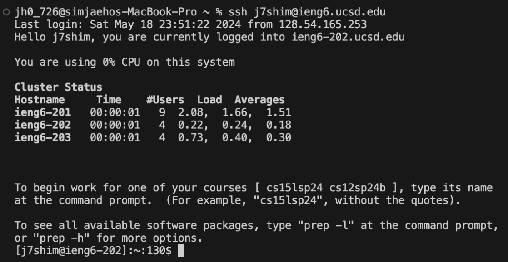
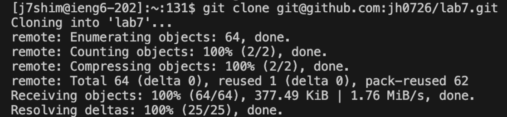
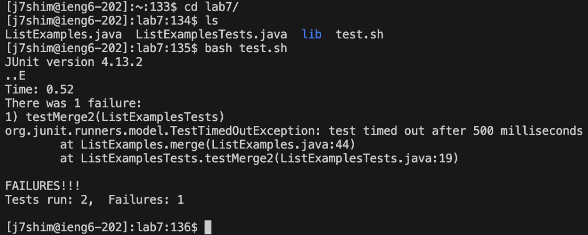
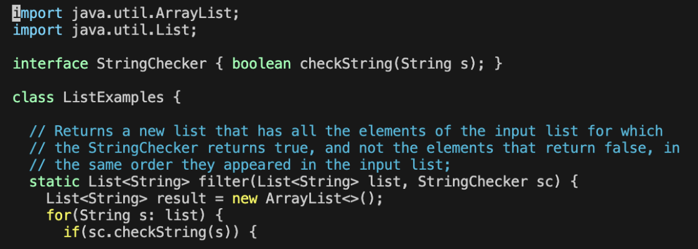
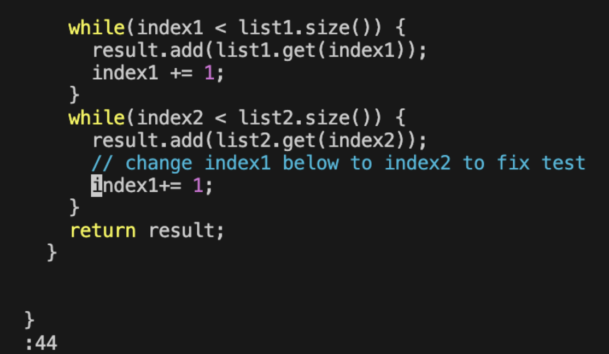
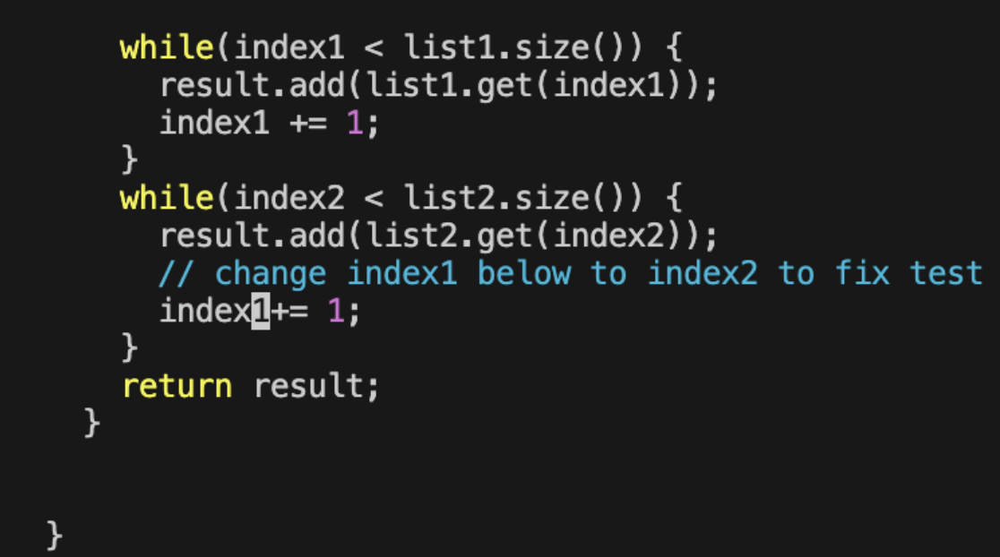
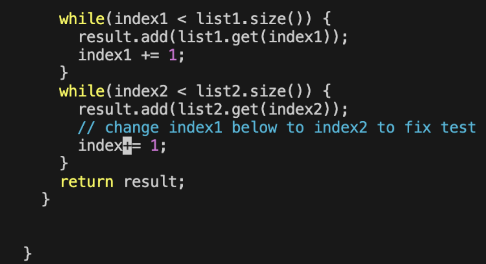
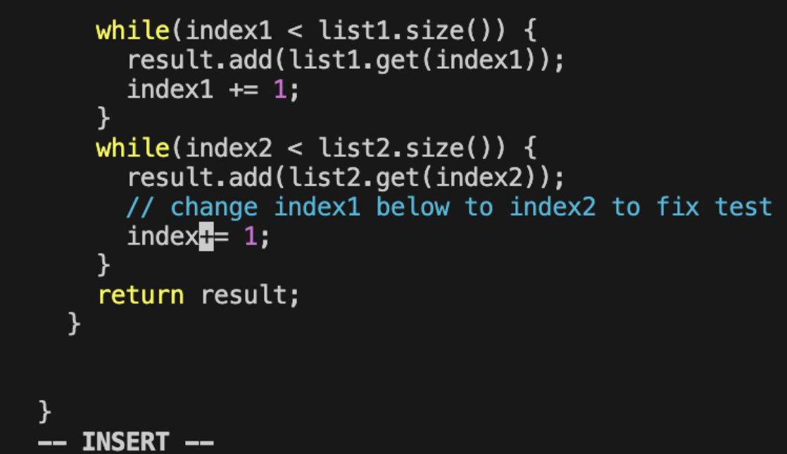
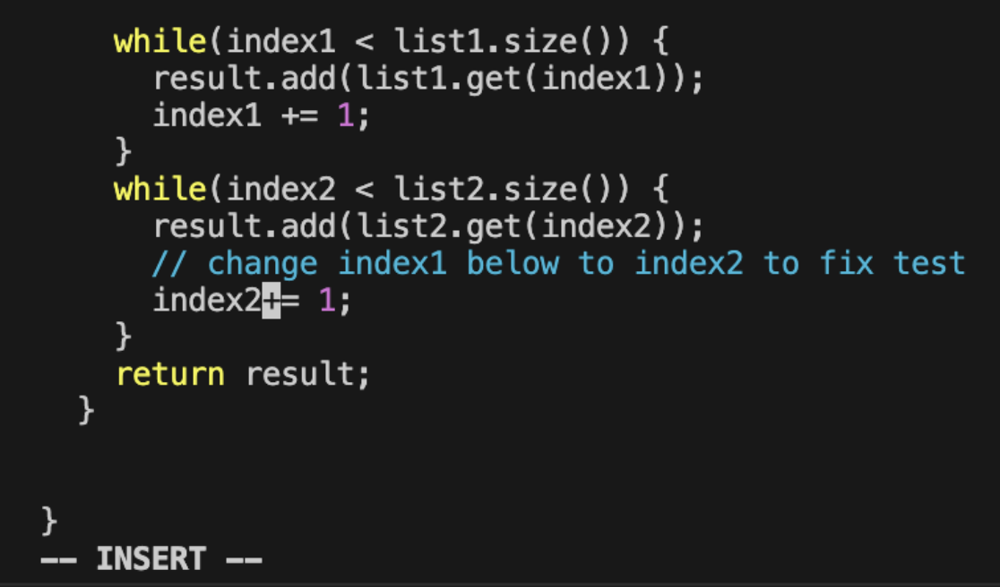

## Log in to ieng6
### **ssh `<space>` j7shim@ieng6.ucsd.edu `<enter>`**

Logged in to the ieng6 server with private key I have on my MacBook. 

***

## Clone My Fork of the Repository from My Github Account (Using the SSH URL)
### **git `<space>` clo `<tab>` `<space>` `<ctrl + v>` `<enter>`**

Cloned the forked repository from my github account into the ieng6 server. 
* `<tab>`: *automatically fills out the remaining command line. In this case automatically completed 'clone'*
* `<ctrl + v>`: *pastes the ssh url of the forked repository from my github, which was 'git@github.com:jh0726/lab7.git'.*

***

## Run the Tests, Demonstrating That They Fail
### **cd `<space>` l `<tab>` `<enter>`**
### **ls `<enter>`**
### **bash `<space>` te `<tab>` `<enter>`**

Changed the current directory to lab7 and runned the command lines in test.sh file. 
* `<tab>`: *automatically fills out the remaining command line. In this case automatically completed 'clone'*

***

## Edit the Code File to Fix the Failing Test 
### **vim `<space>` ListExamples.java `<enter>`**

Used vim to access the code of the java file that produced error and fix it. In this case, the error message indicated the error came from ListExamples.java file. Therefore, tried to access the java code of ListExamples.java file using vim. 

### **:44 `<enter>`**

Referencing the error message, it indicated that the error came from line 44. To directly move on to line 44 rather than pressing down arrow key 44 times, used ':(line number)' vim command. 

### **5l**

The error on the line 44 was incorrect index number. Since the incorrect integer was written on the 5th index right from the first index, used 'l(move right)' vim command with the value of number of times moving to right in front of it. 

### **dw**

To delete the incorrect integer, used 'dw' vim command. As a result, incorrect integer 1 was deleted.

### **i**

In order to add correct integer after the 'index', changed to insertion mode by typing i. 

### **2 `<esc>`**

Added 2 after the index to fix the error. Pressed escape key to change it back to the default mode from the insertion mode. 
* `<esc>`: escape from the insertion mode and goes back to the default. 

### **:wq `<enter>`**
In order to save the edits I made in the ListExamples,java and exit, used ':wq' vim command. 

***

## Run the Tests, Demonstrating that They Now Succeed

## Commit and Push the Resulting Change to My Github Account (Any Commit Message!)

